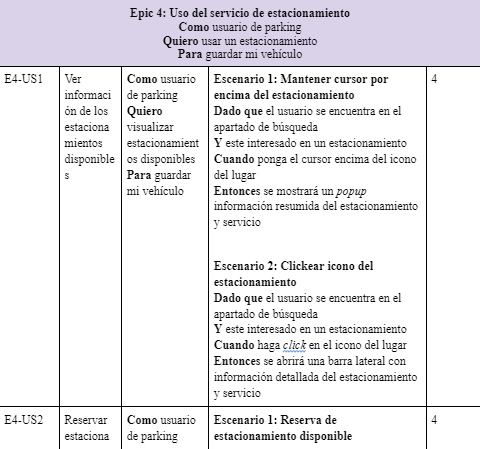
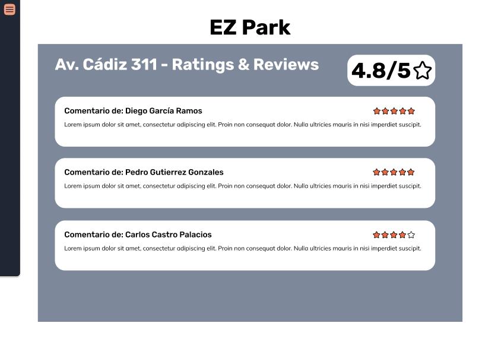
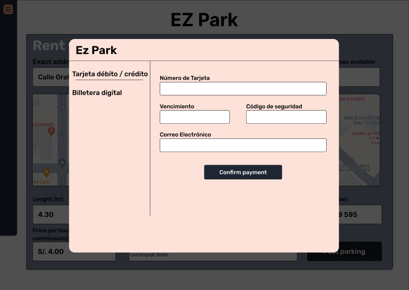
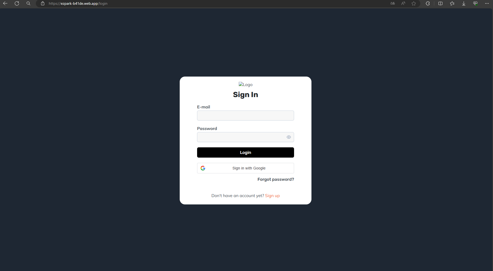
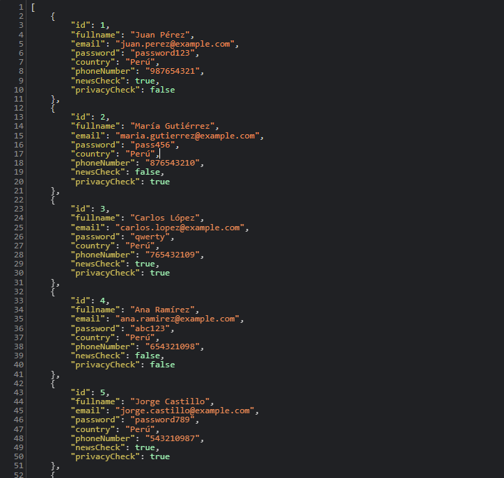

# <p align="center">Informe de Trabajo Final</p>

## <p align="center">Universidad Peruana de Ciencias Aplicadas</p>

<div align="center">
  
</div>

<p align="center">Ingeniería de Software</p>
<p align="center">Aplicaciones Web - SW55</p>
<p align="center"><strong>Docente:</strong> Francisco José Cáceres Honores</p>
<p align="center"><strong>Startup:</strong> Parkers</p>
<p align="center"><strong>Producto:</strong> EzPark</p>

<p align="center"><strong>Team members:</strong></p>

| Nombre                            | Código     |
| --------------------------------- | ---------- |
| Oliveira Paucar, Mauricio         | U201719831 |
| Garro Vega, Marcelo Fabian        | U20201C410 |
| Méndez Vargas, Sebastian Orlando  | U20201F140 |
| Gonzales Arotinco, Bruno Leonardo | U201820037 |

<p align="center"><strong>Ciclo 2024-01</strong></p>

# Registro de versiones del informe

| Versión | Fecha      | Autor             | Descripción de modificación                                                                                                                                                                                                                                                                 |
| ------- | ---------- | ----------------- | ------------------------------------------------------------------------------------------------------------------------------------------------------------------------------------------------------------------------------------------------------------------------------------------- |
| Row 1   | 03/04/2024 | Equipo de Parkers | En esta primera entrega se han incluido los capítulos:<br />Capítulo I: Introducción <br />Capítulo II: Requirements Elicitation & Analysis<br />Capítulo III: Requirements Specification<br />Capítulo IV: Product Design<br />Capítulo V: Product Implementation, Validation & Deployment |

# Student Outcomes

ABET – EAC - Student Outcome 5: La capacidad de funcionar efectivamente en un equipo cuyos miembros juntos proporcionan liderazgo, crean un entorno de colaboración e inclusivo,
establecen objetivos, planifican tareas y cumplen objetivos.

| Criterio específico                                                                                                                                  | Acciones realizadas                                                                                                                                                                                                                                                                                                                                                                                                                                                                                                                                                                                                                                                                                                                                                                                                                                                                                                                                                                                                                                                                                                                                                                                                                                      | Conclusiones                                                                                                                                                                                                                                                                                                                                                                                                                                        |
| ---------------------------------------------------------------------------------------------------------------------------------------------------- | -------------------------------------------------------------------------------------------------------------------------------------------------------------------------------------------------------------------------------------------------------------------------------------------------------------------------------------------------------------------------------------------------------------------------------------------------------------------------------------------------------------------------------------------------------------------------------------------------------------------------------------------------------------------------------------------------------------------------------------------------------------------------------------------------------------------------------------------------------------------------------------------------------------------------------------------------------------------------------------------------------------------------------------------------------------------------------------------------------------------------------------------------------------------------------------------------------------------------------------------------------- | --------------------------------------------------------------------------------------------------------------------------------------------------------------------------------------------------------------------------------------------------------------------------------------------------------------------------------------------------------------------------------------------------------------------------------------------------- |
| Participa en equipos multidisciplinarios con eficacia, eficiencia y objetividad, en el marco de un proyecto en soluciones de ingeniería de software. | Oliveira Paucar, Mauricio<br/>TB1: En la presentación de la TB1 desarrollamos en equipo la mayoría del Capítulo 1, así como también las User Stories que son muy importantes en todo el proyecto. Por otro lado, nos organizamos como equipo para desarrollar de manera individual varios capítulos después de quedar claras las pautas generales.<br/> <br/>Garro Vega, Marcelo Fabian<br/>TB1: En el desarrollo de este entregable buscamos encontrar las necesidades de nuestro segmento objetivo. Buscamos como equipo una organización de actividades para mantener una mejor eficiencia.<br/><br/>Méndez Vargas, Sebastian Orlando<br/>TB1: Para este entregable, logramos tener en claro la solución que queremos brindar a nuestro segmentos objetivos. Asimismo, estuve pendiente de las reuniones que realizamos con mi equipo y trabajamos según un marco de progreso y de forma colaborativa en todo momento.<br/>Gonzales Arotinco, Bruno Leonardo<br/>TB1: Para lograr los objetivos de la entrega, nuestro grupo se ha reunido para hacer una trabajo más completo para poder llegar al objetivo propuesto que se pidió para esta entrega.                                                                                                | TB1: La coordinación y planificación de tareas es muy importante para el correcto desarrollo y para el cumplimiento de los plazos de entrega. Por otro lado, el entendimiento total del funcionamiento de la plataforma por parte de todos los integrantes es fundamental, ya que, sin un entendimiento por claro, la designación de tareas individuales puede ser crítica ya que se podrían generar funcionalidades diferentes a la idea original. |
| Conoce al menos un sector empresarial o domínio de aplicación de soluciones de software.                                                             | Oliveira Paucar, Mauricio<br/>TB1: En la presentación de TB1 pude realizar dos entrevistas a usuarios y registrarlas con sus respectivos resúmenes. Asimismo, redacté las historias de usuario y el product backlog. Por otro lado, desarrollé el diseño del producto de landing page y aplicación web con la herramienta Figma<br/><br/>Garro Vega, Marcelo Fabian<br/>TB1: Tras entrevistar a nuestro segmento objetivo, comprendimos sus necesidades diarias, lo que nos permitió identificar problemas destacados y preferencias para ofrecer soluciones personalizadas e innovadoras.<br/><br/>Méndez Vargas, Sebastian Orlando<br/>TB1: Tras entrevistar a nuestro segmento objetivo, logré comprender y entender las necesidades, a veces repentinas, con las que lidian a diario. Es por este motivo que se logró identificar los problemas más resaltantes y preferencias que tienen ellos mismos para así llegar a una solución innovadora y personalizada para cada uno de nuestros usuarios.<br/><br/>Gonzales Arotinco, Bruno Leonardo<br/>TB1: Tras investigar un poco sobre nuestro mercado y conociendo las necesidades de nuestros entrevistados. Se logro identificar los problemas más resaltantes para llegar a una conclusión final | TB1: En esta etapa, se llevó a cabo una investigación hacia los segmentos objetivos con los que cuenta nuestro producto, así como de sus competidores más directos en el tema de sistemas de reservas de estacionamientos. Logramos identificar factores que podrían distinguir nuestra solución entre las tantes que existen y exploramos distintas funcionalidades a implementar en próximas entregas.                                            |

# Capítulo 1

## 1.1. Startup Profile

### 1.1.1. Descripción de la Startup

EzPark surge como una solución ante la creciente preocupación por la escasez de espacios de estacionamiento en entornos urbanos. La agobiante congestión del tráfico y la ineficiente búsqueda de lugares para estacionar generan frustración y retrasos en la experiencia de los conductores a nivel global. A su vez, aquellos que poseen espacios de estacionamiento no utilizados se enfrentan al desafío de encontrar una manera efectiva de aprovechar estos activos.

EzPark se propone revolucionar la forma en que las personas encuentran y utilizan espacios de estacionamiento. Crearemos una aplicación que ofrecerá una interfaz intuitiva que les permitirá buscar, reservar y pagar por estacionamientos de manera rápida y fluida. Los usuarios podrán ubicar fácilmente espacios disponibles cerca de su destino, ahorrando tiempo y evitando la frustración de la búsqueda ineficiente. Por otro lado, los propietarios de espacios de estacionamiento podrán registrarse en la plataforma y ofrecer sus espacios disponibles para alquiler. La aplicación permitirá a los propietarios gestionar sus listados, establecer precios, disponibilidad y recibir pagos de manera segura. Esto les brindará una forma eficaz de aprovechar sus activos, generando ingresos adicionales mientras contribuyen a aliviar la congestión del tráfico.

### 1.1.2. Perfiles de integrantes del equipo

|                                                                                 | Oliveira Paucar, Mauricio                                                                                                                                                                                                                                                                                                                                                                                                                               |
| ------------------------------------------------------------------------------- | ------------------------------------------------------------------------------------------------------------------------------------------------------------------------------------------------------------------------------------------------------------------------------------------------------------------------------------------------------------------------------------------------------------------------------------------------------- |
|  | <strong>Ingeniería de Software - U201719831</strong><br />Tengo 23 años, me gusta mucho aprender cosas nuevas sobre mi carrera, trabajar en equipo de manera proactiva y lograr los objetivos junto a mis compañeros. Me considero una persona ambiciosa, ya que mi meta es llegar a obtener un alto cargo en una empresa que me agrade o formar mi propia empresa relacionada al software. Gracias a ello siempre podré trabajar en algo que me guste. |

|                                                                                | Garro Vega, Marcelo Fabian                                                                                                                                                                                                                                                                                                                                                                                                                                                                                                                             |
| ------------------------------------------------------------------------------ | ------------------------------------------------------------------------------------------------------------------------------------------------------------------------------------------------------------------------------------------------------------------------------------------------------------------------------------------------------------------------------------------------------------------------------------------------------------------------------------------------------------------------------------------------------ |
|  | <strong>Ingeniería de Software - U20201C410</strong><br />Soy un estudiante universitario de 21 años apasionado por el mundo de la tecnología y su capacidad para resolver problemas cotidianos. Me considero una persona organizada, responsable y optimista que busca la mejor manera solucionar los problemas. <br/> Me especializo en el ámbito del desarrollo frontend, priorizando siempre la experiencia del usuario. <br/>Me comprometo a ser un gran aporte al equipo, apoyando a mis compañeros y compartir mis conocimientos de desarrollo. |

|                                                                                   | Méndez Vargas, Sebastian Orlando                                                                                                                                                                                                                                                                                                                                                                                               |
| --------------------------------------------------------------------------------- | ------------------------------------------------------------------------------------------------------------------------------------------------------------------------------------------------------------------------------------------------------------------------------------------------------------------------------------------------------------------------------------------------------------------------------ |
|  | <strong>Ingeniería de Software - U20201F140</strong><br />Tengo 21 años y disfruto de temas relacionados a la tecnología moderna (IA, machine learning, etc).</br> Aprendo mucho al trabajar en equipos y soy creativo a la hora de proponer ideas y soluciones tecnológicas. Me considero como una persona sociable y que le gusta compartir ideas con sus compañeros, todo sea por dar lo mejor de nosotros en cada trabajo. |

|                                                                           | Gonzales Arotinco, Bruno Leonardo                                                                                                                                                                                                                                                                                                                                                                                                                                               |
| ------------------------------------------------------------------------- | ------------------------------------------------------------------------------------------------------------------------------------------------------------------------------------------------------------------------------------------------------------------------------------------------------------------------------------------------------------------------------------------------------------------------------------------------------------------------------- |
|  | <strong>Ingeniería de Software - U201820037</strong><br />Mi edad es 24 años y disfruto adquiriendo nuevos conocimientos sobre mi carrera. Me destaco por colaborar de forma activa en equipos y alcanzar metas junto a ellos. Soy una persona divertida, ya que intento buscarle lo divertido a la vida y a nivel profesional busco establecer mi propio negocio en el ámbito del software. Esta ambición me motiva a trabajar en un área que me apasione de manera constante. |

## 1.2. Solution Profile

### 1.2.1 Antecedentes y problemática

**Antecedentes**
En la actualidad, las áreas urbanas experimentan un aumento constante en la congestión del tráfico debido al crecimiento de la población y al incremento del uso de vehículos motorizados.

Este problema de tráfico, agravado por la ineficiente búsqueda de espacios de estacionamiento, ha generado una experiencia frustrante para los conductores en todo el mundo. Además, esta situación también representa un desafío para quienes poseen espacios de estacionamiento no utilizados en áreas urbanas, ya que no cuentan con una plataforma efectiva para aprovechar estos activos.

**Problemática**

What?

La problemática percibida por nuestra startup es la escasez de espacios de estacionamiento en los entornos urbanos y la complejidad actual en la búsqueda de lugares para estacionar. Esto es debido a la alta demanda de vehículos motorizados para las actividades cotidianas.

When?

Esta preocupación ha estado aumentando a lo largo del tiempo, a medida que las ciudades han experimentado un crecimiento de la población y, por lo tanto, la cantidad de vehículos en circulación, la congestión de tráfico y la búsqueda ineficiente de estacionamiento se ha vuelto más apremiante en los últimos años.

Where?

El problema surge principalmente en áreas urbanas densamente pobladas de todo el mundo, donde el espacio es limitado y la demanda de vehículos es alta.

Who?

Los afectados por este problema son los conductores que enfrentan las dificultades para encontrar lugares de estacionamiento convenientes. Además, muchos propietarios de espacios de estacionamiento tienden a enfrentarse a empresas grandes dedicadas a este rubro, dificultando la promoción de sus servicios.

Why?

Esto ocurre debido a la insuficiencia de lugares de estacionamiento disponibles en áreas urbanas, lo que lleva a una congestión de tráfico más intensa y a la dificultad para los conductores de encontrar estacionamientos de manera oportuna.

How?

El problema sucede cuando la congestión del tráfico y la falta de espacios de estacionamiento disponibles conlleva a que la población tenga dificultades de encontrar estacionamientos de manera conveniente y eficiente.

How much?

El problema de la escasez de espacios de estacionamiento afecta de manera significativa a Lima, la capital, donde de acuerdo con un estudio realizado por la ONG Luz Ámbar en 2016 se ha demostrado que hay una insuficiencia de alrededor de 45,000 estacionamientos vehiculares en cinco distritos. Sin embargo, esta cifra resulta insuficiente en comparación con el tamaño del parque automotor de la ciudad, que consta de aproximadamente 1 millón 800,000 unidades. Esta disparidad entre la cantidad de vehículos y la disponibilidad de estacionamientos contribuye a la congestión del tráfico y al desafío constante para los conductores de encontrar lugares para estacionar de manera eficiente.

### 1.2.2 Lean UX Process.

#### 1.2.2.1. Lean UX Problem Statements.

**Problem Statement 1: Usuario de parking**

En la actualidad, el uso de vehículos motorizados ha sido un gran avance para la movilidad de los ciudadanos en las zonas urbanas del Perú. Debido a la alta demanda, muchos establecimientos dedicados al servicio de estacionamientos experimentaron escasez de espacios disponibles.

Hemos encontrado en los conductores dificultades para encontrar espacios disponibles para estacionar, lo que genera una gran pérdida de tiempo y una experiencia frustrante. En la mayoría de los casos, terminan dejando sus vehículos en las vías públicas expuestos a cualquier riesgo.

¿Cómo podemos facilitar a los usuarios una forma eficiente y rápida de encontrar espacios disponibles para estacionar sus vehículos motorizados?

**Problem Statement 2: Anfitriones**

Nuestra aplicación ofrece al usuario la posibilidad de promocionar sus garajes con el propósito de ponerlos en alquiler para el uso de los conductores del Perú. generando ingresos pasivos al propietario.

Hemos encontrado que los propietarios sienten inseguridad al permitir que las personas desconocidas tengan acceso a sus garajes, puesto que estos por lo general forman parte de las viviendas.

¿Cómo podemos brindar al propietario la seguridad de sus bienes inmobiliarios al promocionar sus servicios de estacionamiento en nuestra aplicación?

#### 1.2.2.2. Lean UX Assumptions.

**<ins>Business Assumptions</ins>**

1. **Creo que mis usuarios necesitan** una mejor manera de encontrar lugares de estacionamientos y, de ser posible, reservarlos.
2. **Estas necesidades se pueden resolver** con una aplicación que les permite a los conductores reservar en los garajes de la ciudad, debido a que la mayoría del tiempo se encuentran desocupados o libres.
3. **Mis clientes iniciales son** los ciudadanos que cuenten con algún vehículo motorizado con dificultades para encontrar estacionamiento y/o deseen poner en alquiler sus garajes.
4. **El valor #1 que el cliente requiere de mi servicio** es encontrar y reservar espacios para estacionar en un corto periodo de tiempo. Además, los usuarios desean saber si esta metodología es totalmente segura para ambos tipos de usuario.
5. **Voy a adquirir a mis clientes a través de** estrategias de Marketing en diversas redes sociales, resaltando las principales características y beneficios de la aplicación.
6. **Mi competencia en el mercado** serán las empresas que se dedican a ofrecer sus servicios de estacionamiento.
7. **Los venceremos debido a que** ofrecemos a los usuarios poder generar ingresos de manera pasiva al rentar sus garajes como estacionamiento.
8. **Mis mayores riesgos del producto es** no encontrar una manera de brindar seguridad a los conductores como a los propietarios de los garajes.
9. **Resolveremos esto con** la incorporación de un sistema que se encargue de validar los parámetros de seguridad de los conductores y los garajes en alquiler para ofrecer una mayor seguridad al público.

**Sabremos que hemos tenido éxito cuando veamos los siguientes cambios en el comportamiento de nuestros clientes:**

- Reducción significativa en los tiempos de búsqueda de espacios disponibles para estacionar.
- Ingresos económicos en los propietarios con garajes registrados en la aplicación.

**¿Qué otras suposiciones tenemos que, de probarse falsas, pueden causar el fracaso del proyecto?**

- El permitir el acceso a cualquier usuario con propósitos malignos o perversos generará en todos los usuarios inseguridad. Por consiguiente, muchos de ellos dejarán la aplicación.

**<ins>User Assumptions</ins>**
**Clientes de parking**
¿Quién es el usuario?
Conductores que en su día a día necesitan encontrar estacionamiento para sus vehículos motorizados.

¿Dónde encaja nuestro servicio? ¿En su trabajo o en su vida?
Nuestro servicio encaja tanto para su trabajo como para sus actividades diarias. El usuario tiene la necesidad de encontrar un estacionamiento cercano a su puesto de trabajo. Asimismo, para otras actividades en algún punto específico de la ciudad desean tener su vehículo en un lugar cercano.

¿Qué problema tiene nuestro servicio y cómo se resuelve?
Problema será la posible inseguridad del usuario al alquilar en una cochera de cualquier persona desconocida.
Lo podemos resolver mediante un sistema de filtros que garanticen al usuario la seguridad de la cochera y contar con bases legales para la publicación del producto.

¿Cuándo y cómo es usado nuestro producto?
El producto es usado mayormente cuando el usuario necesita encontrar algún lugar de estacionamiento para cualquier actividad.
La aplicación se puede usar como un sistema de búsqueda y reserva de cocheras.

**Anfitriones de garajes**
¿Quién es el usuario?
Personas con garajes que desean poner en alquiler para generar ingresos pasivos.

¿Dónde encaja nuestro servicio? ¿En su trabajo o en su vida?
Nuestro servicio encaja en su vida porque pueden poner en alquiler sus garajes mientras realizan cualquier actividad.

¿Qué problema tiene nuestro servicio y cómo se resuelve?
El problema será el proceso para poder registrar sus cocheras, debido a que puede llegar a ser confuso o tedioso para el anfitrión.
Lo podemos resolver mediante capacitación sobre el proceso de filtros para facilitar al usuario el registro.

¿Cuándo y cómo es usado nuestro producto?
Nuestra aplicación es usada principalmente cuando el anfitrión dispone de cualquier garaje disponible que desee poner en alquiler para generar ingresos.
Nuestro producto es usado como un gestor de cocheras sobre reservas, estados, recibos, etc.

**<ins>Features</ins>**

¿Qué características son importantes?

- Hacer reservas de estacionamientos desde cualquier ubicación con conexión a internet, ya sea mediante un ordenador o un dispositivo móvil.
- Inscribir estacionamientos para alquilar y obtener ingresos adicionales según la tarifa establecida por el propietario.
- Verificar la disponibilidad de estacionamientos dentro de la zona o dirección especificada.

¿Cómo debe verse y comportarse nuestro producto?

- La interfaz de usuario contará con un diseño intuitivo, sencillo y atractivo, siguiendo las pautas de estilo específicas de nuestro sector.
- Se enfocará principalmente en la experiencia del usuario para garantizar una alta eficiencia en el funcionamiento de la aplicación.
- Estará disponible las 24 horas del día, los 7 días de la semana.
- Se respalda con una sólida arquitectura de software para abordar cualquier incidencia que pueda surgir.

#### 1.2.2.3. Lean UX Hypothesis Statements.

1. **Creemos que** la función de reservar cocheras facilitará al usuario conseguir un espacio para estacionamiento.
   **Sabremos que** tendremos éxito
   **Cuando** la mayoría de los usuarios demoren en conseguir estacionamiento en un plazo máximo de 5 minutos.

2. **Creemos que** la implementación del mapa de Google Maps permitirá al usuario una mejor búsqueda de cocheras.
   **Sabremos que** estaremos en lo cierto
   **Cuando** el 100% de nuestros usuarios no presentan dificultades para encontrar cocheras.

3. **Creemos que** proporcionar al usuario registrar sus cocheras aumentará la cantidad de estacionamientos
   **Sabremos que** estaremos en lo cierto
   **Cuando** el índice de escasez de estacionamientos se reduzca en un 20%.

#### 1.2.2.4. Lean UX Canvas.


### 1.3. Segmentos objetivos.

Nuestro segmento objetivo está compuesto por dos tipos de usuarios:

**Guest:** Individuo que busca soluciones convenientes y accesibles para sus necesidades de buscar estacionamiento en entornos urbanos para su vehículo.

**Host:** Propietario de una vivienda cuente con una cochera privada que busque sacar provecho de forma efectiva de estos mismos.

# Capítulo 2

## 2.1. Competidores

Para realizar el análisis competitivo, hemos tomado en consideración competidores directos en su mayoría como:

- **SpotHero**: SpotHero es un mercado de estacionamiento digital que conecta a los conductores que buscan reservar y pagar espacios de estacionamiento con estacionamientos, garajes de estacionamiento y servicios de valet.

<div align="center">
</div>

- **ParkWhiz**: ParkWhiz es un servicio de estacionamiento electrónico que permite a los usuarios reservar espacios de estacionamiento antes de llegar a sus destinos. La sede de ParkWhiz se encuentra en Chicago, Illinois.

<div align="center">
</div>

- **ParkMobile**: ParkMobile es una aplicación web y móvil que ofrece pagos de estacionamiento en América del Norte. Con sede en Atlanta, Georgia, los usuarios pueden pagar el estacionamiento en la vía pública y fuera de ella mediante una aplicación en su teléfono inteligente, un navegador web o llamando a un número de teléfono.

<div align="center">
</div>

## 2.1.1. Análisis competitivo

<table>
  <tr>
    <th colspan="6" valign="top">Competitive Analysis Landscape</th>
  </tr>
  <tr>
    <td colspan="2" valign="top">¿Por qué llevar a cabo este análisis?</td>
    <td colspan="4" valign="top">El objetivo de este análisis es identificar las características de los competidores y encontrar maneras de diferenciarnos.</td>
  </tr>
  <tr>
    <td colspan="2" rowspan="2" valign="top">Startup y Competidores</td>
    <td valign="top">EzPark</td>
    <td valign="top">SpotHero</td>
    <td valign="top">ParkWhiz</td>
    <td valign="top">ParkMobile</td>
  </tr>
  <tr>
    <td valign="top"></td>
    <td valign="top"></td>
    <td valign="top"></td>
    <td valign="top"></td>
  </tr>
  <tr>
    <td rowspan="2" valign="top">Perfil</td>
    <td valign="top">Overview</td>
    <td valign="top">Ofrece al usuario poder encontrar un estacionamiento seguro en Lima donde pueda guardar su vehículo de una forma que el usuario no se preocupe por problemas de robo y otros. Así como también que una persona pueda alquilar su cochera a un vehículo.</td>
    <td valign="top">Permite a los conductores reservar estacionamientos en línea y proporciona herramientas para que los propietarios de estacionamientos gestionen sus espacios.</td>
    <td valign="top">Ofrece reservas de estacionamiento en línea y una plataforma para propietarios de estacionamientos para comercializar y gestionar sus espacios no utilizados.</td>
    <td valign="top">Ofrece una aplicación que permite a los conductores encontrar y pagar por estacionamiento en la calle y en garajes, así como reservar espacios en algunos lugares.
</td>
  </tr>
  <tr>
    <td valign="top">Ventaja competitiva ¿Qué valor ofrece a los clientes?</td>
    <td valign="top">Brinda promociones a los usuarios concurrentes. Además de poder generar confianza en ellos al encontrar estacionamientos en zonas concurridas y también poder hacer que el usuario alquile sus cocheras.</td>
    <td valign="top">Encontrar estacionamientos en zonas concurridas.</td>
    <td valign="top">Vende a sus consumidores un lugar seguro para estacionarse de una manera mas segura.</td>
    <td valign="top">Cuando buscas un estacionamiento, hay un filtro para los rangos de precios. Además, cuentan con solo las etiquetas específicas.</td>
  </tr>
  <tr>
    <td rowspan="2" valign="top">Perfil de Marketing</td>
    <td valign="top">Mercado objetivo</td>
    <td valign="top">Personas con vehículos que transitan por lugares muy concurridos de vehículos.</td>
    <td valign="top">Personas que buscan un lugar de parqueo.</td>
    <td valign="top">Usuarios de vehículos que viaja mucho por otro lugars.</td>
    <td valign="top">Personas con vehículos que transitan por lugares muy concurridos.</td>
  </tr>
  <tr>
    <td valign="top">Estrategias de marketing</td>
    <td valign="top">Anunciar por redes sociales, implementar programas de referencia.</td>
    <td valign="top">Solo en App store y Google Play.</td>
    <td valign="top">Facebook, Instagram y Youtube lo promocionan.</td>
    <td valign="top">Facebook y Youtube lo promocionan.</td>
  </tr>
  <tr>
    <td rowspan="3" valign="top">Perfil de Producto</td>
    <td valign="top">Productos & Servicios</td>
    <td valign="top">Búsqueda de parking por filtros y precios.</td>
    <td valign="top">Reserva de parking en zonas concurridas.</td>
    <td valign="top">Reserva de estacionamientos .</td>
    <td valign="top">Búsqueda de parqueo con filtros.</td>
  </tr>
  <tr>
    <td valign="top">Precios & Costos</td>
    <td valign="top">Suscripción.</td>
    <td valign="top">Suscripción premium y Pro.</td>
    <td valign="top">Inscripción a su club ParkWhiz.</td>
    <td valign="top">Suscripción.</td>
  </tr>
  <tr>
    <td valign="top">Canales de distribución (Web y/o Móvil)</td>
    <td valign="top">Principalmente a través de su sitio web oficial y redes sociales.
    </td>
    <td valign="top">Principalmente a través de su sitio web oficial y en tiendas virtuales.
    </td>
    <td valign="top">Principalmente a través de su sitio web oficial y redes sociales.
    </td>
    <td valign="top">Principalmente a través de su sitio web oficial y redes sociales.
    </td>
  </tr>
  <tr>
    <td rowspan="4" valign="top">Análisis SWOT</td>
    <td valign="top">Fortalezas</td>
    <td valign="top">Generar al usuario la confianza que necesita hacia nuestra aplicación.
    </td>
    <td valign="top">Reserva con dias de anticipacion.</td>
    <td valign="top">Disfruta de su viaje mientras nosotros protegemos su vehículo.</td>
    <td valign="top">Proporcionar las ubicaciones de los estacionamientos más seguros.</td>
  </tr>
  <tr>
    <td valign="top">Debilidades</td>
    <td valign="top">Temor de los usuarios de confiar en desconocidos que encuentran en la aplicación.</td>
    <td valign="top">Preocupación de los usuarios sobre la posibilidad de que la plataforma les cobre un pequeño cargo adicional por reservar con mucha anticipación.</td>
    <td valign="top">Los usuarios deben pedir con anticipación reserva para que llegue a tiempo o puede generar un retraso.</td>
    <td valign="top">El diseño del aplicativo genera desconfianza, lo que puede llevar a los usuarios a ser redirigidos a lugares no deseados, con posibles riesgos.</td>
  </tr>
  <tr>
    <td valign="top">Oportunidades</td>
    <td valign="top">El crecimiento del interés por hallar un lugar seguro donde estacionar en cualquier distrito de Lima.
    </td>
    <td valign="top">Probar otros métodos de pago
    </td>
    <td valign="top">La gente confía más en una aplicación con mucha ayuda externa
    </td>
    <td valign="top">La experiencia de conocer e ir a lugares nuevos y estacionar su vehículo de manera segura.
    </td>
  </tr>
  <tr>
    <td valign="top">Amenazas</td>
    <td valign="top">Dificultad de que los usuarios sean estafados en algún momento
    </td>
    <td valign="top">Dificultad de que los usuarios permanezcan por los altos precios que ofrecen.
    </td>
    <td valign="top">Los usuarios que quisieran con urgencia un estacionamiento, no podrían contar con la app.
    </td>
    <td valign="top">Problemas en la interfaz de la app.
    </td>
  </tr>
</table>

## 2.1.2. Estrategias y tácticas frente a competidores

Entre las principales estrategias y tácticas que ejecutaremos como startup se encuentran:

- Nuestra estrategia se centra en aprovechar nuestra principal ventaja competitiva: precios altamente competitivos en comparación con otros servicios similares en el mercado. Nuestro objetivo es atraer la mayor cantidad de clientes posible mediante esta ventaja de precios. Una vez que hayamos consolidado una base sólida de clientes, planeamos realizar encuestas de satisfacción y, si es posible, llevar a cabo entrevistas con ellos.

- Nuestra estrategia implica buscar oportunidades para integrar nuestro software con otras herramientas ampliamente utilizadas y reconocidas en el sector empresarial, como Google Calendar, Zoom, Google Maps entre otras. Al hacerlo, nuestro objetivo es construir un ecosistema cohesivo que se adapte de manera fluida al contexto y las necesidades específicas de cada usuario. Esta integración permitirá a nuestros usuarios disfrutar de una experiencia web más completa y sin interrupciones al utilizar nuestra aplicación.

## 2.2. Entrevistas

### 2.2.1. Diseño de entrevistas

Segmento objetivo: Usuario de Parking y Anfitrión

1. ¿Cuál es su nombre?
1. ¿Que edad tiene?
1. ¿En qué distrito reside?
1. ¿A que se dedica?
1. ¿Actualmente cuenta con algún tipo de vehículo?
1. ¿Cuántas veces a la semana usa su auto?
1. ¿Tiene dificultad para encontrar estacionamiento?
1. ¿En qué distritos suele buscar con mayor frecuencia un estacionamiento?
1. ¿Cuáles cree que son las horas más difíciles para encontrar estacionamiento?
1. ¿Estaría dispuesto a utilizar una cochera diferente a la tradicional?
1. ¿Con qué frecuencia usaría este servicio?
1. ¿Cree que sería de utilidad una aplicación que le ayude a buscar de manera más eficiente estos tipos 1. de estacionamientos?
1. ¿Qué requisitos mínimos cree que deberían cumplir los estacionamientos para que se sienta seguro de 1. dejar su vehículo en dichos lugares?
1. ¿Cuenta usted con algún espacio de estacionamiento disponible en su hogar?
1. ¿Usted estaría dispuesto a alquilarlo? ¿Por qué?
1. ¿Cada cuánto tiempo alquilaría su cochera?
1. ¿Cree que sería de utilidad una aplicación que le ayude a alquilar y publicitar su espacio de una manera eficiente?

### 2.2.2. Registro de entrevistas.

Segmento objetivo: Usuario de Parking y Anfitrión
Entrevista 1: Juan Carlos Bodoque Bolaños (26 años - San Miguel) - 4 de abril del 2023
URL del video: [Entrevistas](https://upcedupe-my.sharepoint.com/:v:/g/personal/u20201c410_upc_edu_pe/ESO5uEQLJUpJv5oRx-H9DbgBQ2BZ0bczJgFh8GRWHVF6wA?nav=eyJyZWZlcnJhbEluZm8iOnsicmVmZXJyYWxBcHAiOiJPbmVEcml2ZUZvckJ1c2luZXNzIiwicmVmZXJyYWxBcHBQbGF0Zm9ybSI6IldlYiIsInJlZmVycmFsTW9kZSI6InZpZXciLCJyZWZlcnJhbFZpZXciOiJNeUZpbGVzTGlua0NvcHkifX0&e=duBHCs) (Comienzo 00:32:16 - Fin 00:37:06)


Resumen:
Después de entrevistar a Juan Carlos Bodoque Bolaños, un abogado de 26 años residente en el distrito de San Miguel, se han obtenido detalles significativos sobre sus necesidades y preferencias en relación con el estacionamiento. Juan Carlos mencionó tener dificultades para encontrar estacionamiento en su centro de labores en el distrito de San Isidro, así como en zonas turísticas como Miraflores. Destacó que los horarios laborales presentan mayores desafíos para encontrar estacionamiento. Expresó interés en utilizar una plataforma de alquiler de espacios de estacionamiento sí ofrece beneficios económicos y afirmó que la utilizaría diariamente durante los días laborales. En términos de seguridad, señaló la importancia de verificar la identidad de los ocupantes de los espacios y la presencia de agentes de seguridad.
Por otro lado, reveló que tiene dos espacios de estacionamiento disponibles en su hogar y estaría dispuesto a alquilar uno de ellos en todo momento, ya que rara vez lo utiliza. Sugirió que sería útil tener la función de alquiler de espacios de estacionamiento junto con la búsqueda de espacios disponibles en una misma plataforma para mayor eficiencia y para generar ganancias adicionales.

---

Segmento objetivo: Usuario de Parking y Anfitrión
Entrevista 2: Liliana Fu Ye (22 años - Jesús María) - 4 de abril del 2023
URL del video: [Entrevistas](https://upcedupe-my.sharepoint.com/:v:/g/personal/u20201c410_upc_edu_pe/ESO5uEQLJUpJv5oRx-H9DbgBQ2BZ0bczJgFh8GRWHVF6wA?nav=eyJyZWZlcnJhbEluZm8iOnsicmVmZXJyYWxBcHAiOiJPbmVEcml2ZUZvckJ1c2luZXNzIiwicmVmZXJyYWxBcHBQbGF0Zm9ybSI6IldlYiIsInJlZmVycmFsTW9kZSI6InZpZXciLCJyZWZlcnJhbFZpZXciOiJNeUZpbGVzTGlua0NvcHkifX0&e=duBHCs) (Comienzo 00:16:00 - Fin 00:22:02)

Resumen:
Después de entrevistar a Liliana Fu Ye, una estudiante de 22 años de Ingeniería de Software en la UPC y practicante en el banco Interbank, se han recopilado detalles importantes sobre sus hábitos de estacionamiento y sus preferencias en cuanto a la utilización de espacios de estacionamiento. Liliana mencionó que reside en el distrito de Jesús María y utiliza un vehículo prestado por su madre para desplazarse al trabajo y hacer compras los fines de semana en el distrito del Callao. Suele visitar los distritos de San Isidro y el Callao. Identificó las horas laborales y las ocasiones en las que almuerza con amigos en Miraflores como momentos difíciles para encontrar estacionamiento. Expresó su disposición para utilizar un estacionamiento privado y consideró útil una aplicación que muestre estos lugares, ya que actualmente se apoya en GPS que no son precisos para este propósito.
En cuanto a seguridad, sugirió que los estacionamientos deberían ubicarse en lugares privados o contar con personal vigilante en caso de ser públicos. Reveló que tiene dos espacios de estacionamiento en su hogar, pero solo utiliza uno y estaría dispuesta a alquilar el espacio no utilizado de manera indefinida, ya que su padre se ha mudado a otra ciudad con su vehículo. Propuso que la función de alquilar espacios propios esté integrada en la misma aplicación que ayuda a buscar espacios de otros usuarios para mayor comodidad. En cuanto a la tarifa de alquiler mensual, sugirió un precio aproximado de 300 soles, y consideraría cobrar por horas a partir de 5, aunque requiere una deliberación más detenida sobre esta opción.

---

Segmento objetivo: Usuario de Parking y Anfitrión
Entrevista 3: Leonardo Jesús Vargas Navarro (26 años - Ate) - 5 de abril del 2024
URL del video: [Entrevistas](https://upcedupe-my.sharepoint.com/:v:/g/personal/u20201c410_upc_edu_pe/ESO5uEQLJUpJv5oRx-H9DbgBQ2BZ0bczJgFh8GRWHVF6wA?nav=eyJyZWZlcnJhbEluZm8iOnsicmVmZXJyYWxBcHAiOiJPbmVEcml2ZUZvckJ1c2luZXNzIiwicmVmZXJyYWxBcHBQbGF0Zm9ybSI6IldlYiIsInJlZmVycmFsTW9kZSI6InZpZXciLCJyZWZlcnJhbFZpZXciOiJNeUZpbGVzTGlua0NvcHkifX0&e=duBHCs) (Comienzo 00:00:00 - Fin 00:09:09)

Resumen:
Después de entrevistar a Leonardo Jesús Vargas Navarro, un ingeniero civil de 26 años que trabaja actualmente en la empresa D'site Perú y que reside en el distrito de Ate Vitarte, pudimos informarnos sobre su rutina semanal que tiene para con su vehículo y algunas preferencias que tiene a la hora de usar espacios de estacionamiento. Más adelante, Leonardo nos comenta que es dueño de un Hyundai Sedán y cuenta con un garaje para el mismo en su hogar.
En cuanto a sus destinos frecuentes, él suele ir con su vehículo hasta el distrito de San Miguel por temas de trabajo, además de pasear de vez en cuando por distritos como San Isidro o La Molina. Luego, nos comentó que es un poco más complicado conseguir espacios de estacionamiento en las mañanas y al mediodía. Por otro lado, nos expresó que le parecía buena la idea de utilizar un estacionamiento privado, especialmente para los días que va a trabajar.
Sin embargo, identificó algunos aspectos de seguridad que podrían ser útiles para la aplicación, como el hecho de saber quién alquila el espacio privado o que estos espacios existan solo en distritos "no tan movidos". Sobre su disponibilidad para rentar alquilar su espacio de estacionamiento privado,

---

Segmento objetivo: Usuario de Parking y Anfitrión
Entrevista 4: Jesus Pedro Casana (San Miguel) - 5 de Abril, 2024
URL del video: [Entrevistas](https://upcedupe-my.sharepoint.com/:v:/g/personal/u20201c410_upc_edu_pe/ESO5uEQLJUpJv5oRx-H9DbgBQ2BZ0bczJgFh8GRWHVF6wA?nav=eyJyZWZlcnJhbEluZm8iOnsicmVmZXJyYWxBcHAiOiJPbmVEcml2ZUZvckJ1c2luZXNzIiwicmVmZXJyYWxBcHBQbGF0Zm9ybSI6IldlYiIsInJlZmVycmFsTW9kZSI6InZpZXciLCJyZWZlcnJhbFZpZXciOiJNeUZpbGVzTGlua0NvcHkifX0&e=duBHCs) (Comienzo 00:28:36 = Fin 00:32:15)

Terminada la entrevista a Jesus Pedro Casana, el nos comenta que es joven universitario que estudia y trabaja y cuenta con carro propio. Él es consciente que debido a su trabajo le demanda ir a varios distritos de Lima y casi la mayoría del tiempo no consigue un estacionamiento adecuado debido a la gran cantidad de vehículos estacionados que se encuentran por la zona. El también comenta que cuenta con una amplia cochera donde guarda su auto. El entrevistado manifestó su disposición a utilizar estacionamientos privados y reconoció el valor de una aplicación que facilite la visualización de estos lugares. Señaló que actualmente se apoya en sistemas de GPS que no son precisos para encontrar estacionamiento, por lo que considera útil una herramienta que le brinde información específica sobre los espacios disponibles en estacionamientos privados.

---

Segmento objetivo: Usuario de Parking y Anfitrión
Entrevista 5: Edu Arturo Antayhua Ticona (San Miguel) - 6 de Abril, 2024
URL del video: [Entrevistas](https://upcedupe-my.sharepoint.com/:v:/g/personal/u20201c410_upc_edu_pe/ESO5uEQLJUpJv5oRx-H9DbgBQ2BZ0bczJgFh8GRWHVF6wA?nav=eyJyZWZlcnJhbEluZm8iOnsicmVmZXJyYWxBcHAiOiJPbmVEcml2ZUZvckJ1c2luZXNzIiwicmVmZXJyYWxBcHBQbGF0Zm9ybSI6IldlYiIsInJlZmVycmFsTW9kZSI6InZpZXciLCJyZWZlcnJhbFZpZXciOiJNeUZpbGVzTGlua0NvcHkifX0&e=duBHCs) (Comienzo 00:22:03 - Fin 00:28:35)

Se ha entrevistado a Edu Arturo Antayhua Ticona que tiene 21 años y trabaja de bartender. El menciona que usa su vehículo todos los días para ir a trabajar, estudiar y salir con su familia a pasear. Del mismo modo también dice que se le dificulta mucho salir a pasear con su vehículo ya que no encuentra un estacionamiento seguro por las zonas donde él normalmente se moviliza. También menciona que el uso de una aplicación con los servicios que mencionamos le serían de gran ayuda para su día a día..

---

Segmento objetivo: Usuario de Parking y Anfitrión
Entrevista 6. Rodrigo Tornero Loayza (Santiago de Surco) - 6 de Abril, 2024
URL del video: [Entrevistas](https://upcedupe-my.sharepoint.com/:v:/g/personal/u20201c410_upc_edu_pe/ESO5uEQLJUpJv5oRx-H9DbgBQ2BZ0bczJgFh8GRWHVF6wA?nav=eyJyZWZlcnJhbEluZm8iOnsicmVmZXJyYWxBcHAiOiJPbmVEcml2ZUZvckJ1c2luZXNzIiwicmVmZXJyYWxBcHBQbGF0Zm9ybSI6IldlYiIsInJlZmVycmFsTW9kZSI6InZpZXciLCJyZWZlcnJhbFZpZXciOiJNeUZpbGVzTGlua0NvcHkifX0&e=duBHCs) (Comienzo 00:09:10 - Fin 00:15:59)

Se le ha realizado una entrevista a Rodrigo Tornero Loayza que cuenta con 21 años. El menciona que usó su vehículo de Lunes a Sábado para ir a la universidad y comprar algunas cosas que necesita para su universidad. El menciona también que durante la tarde cuando necesite un estacionamiento no hay debido a la alta demanda. El cree que usar la app que brinda nuestro servicio podría solucionar esos problemas y le ayudará a ahorrar un poco de tiempo. Respecto a los servicios de nuestra app, Rodrigo menciona que él considera viable la opción de alquilar una cochera a una persona si los estacionamiento se encuentran ocupados. Del mismo modo el dice que también sería capaz de alquilar su cochera si en algún momento no llegará a usarlo.

### 2.2.3. Análisis de entrevistas.

- Los entrevistados han comentado que sería de mucha utilidad el uso de una aplicación con los servicios que nosotros ofrecemos.. Además ellos son conscientes de la dificultad para conseguir un estacionamiento seguro fuera de su domicilio debido a las altas frecuencias de robo de vehículos.

- El 100% de los entrevistados destacan como aspecto positivo de la integración de herramientas de software para el proceso de búsqueda de estacionamientos que se optimiza significativamente el tiempo que se destina a desarrollar el proceso.

- El 100% de los entrevistados denotan interés y expresaron la utilidad de la plataforma que busca ofrecer Testigos de Vue con JobSync. Especialmente, expresaron que sería de gran utilidad que las pequeñas y medianas empresas que suelen tener presupuesto limitado para la adquisición de estos tipos de software

- Un porcentaje de los entrevistados comentaron que el proceso de búsqueda resultaba ser tedioso/laborioso por la gran cantidad de posibles estacionamientos a encontrar y que algunos no sean de su entera confianza.

## 2.3. Needfinding

En esta sección se presentarán los artefactos resultantes del proceso de análisis de la información recolectada de los segmentos objetivos

### 2.3.1. User Personas

User Persona del Usuario de Parking


User Persona del Usuario de Anfitrión


### 2.3.2. User Task Matrix

En esta sección se presenta el user task matrix, herramienta centrada en los segmentos objetivos que nos permitirá identificar las tareas y objetivos claves de los usuarios

<table>
  <tr>
    <th colspan="1" rowspan="2" valign="top">User Task</th>
    <th colspan="2" valign="top">Jose Sanchez</th>
    <th colspan="2" valign="top">Luis Suarez</th>
  </tr>
  <tr>
    <td colspan="1" valign="top">Frequency</td>
    <td colspan="1" valign="top">Importance</td>
    <td colspan="1" valign="top">Frequency</td>
    <td colspan="1" valign="top">Importance</td>
  </tr>
  <tr>
    <td colspan="1" rowspan="1" valign="top">Busca zonas seguras para estacionarse</td>
    <td valign="top">Sometimes</td>
    <td valign="top">High</td>
    <td valign="top">Often</td>
    <td valign="top">High</td>
  </tr>
  <tr>
    <td colspan="1" rowspan="1" valign="top">Recibir guía o notificación de posibles espacios disponibles</td>
    <td valign="top">Sometimes</td>
    <td valign="top">High</td>
    <td valign="top">Often</td>
    <td valign="top">High</td>
  </tr>
  <tr>
    <td colspan="1" rowspan="1" valign="top">Buscar las zonas más seguras de cada distrito</td>
    <td valign="top">Sometimes</td>
    <td valign="top">Medium</td>
    <td valign="top">Never</td>
    <td valign="top">Low</td>
  </tr>
  <tr>
    <td colspan="1" rowspan="1" valign="top">Participar en ofertas proporcionadas por la app</td>
    <td valign="top">Always</td>
    <td valign="top">High</td>
    <td valign="top">Often</td>
    <td valign="top">High</td>
  </tr>
  <tr>
    <td colspan="1" rowspan="1" valign="top">Revisar notificaciones sobre estado de disposición</td>
    <td valign="top">Sometimes</td>
    <td valign="top">High</td>
    <td valign="top">Never</td>
    <td valign="top">Low</td>
  </tr>
  <tr>
    <td colspan="1" rowspan="1" valign="top">Recibir una respuesta inmediata sobre posibles estacionamientos</td>
    <td valign="top">Always</td>
    <td valign="top">High</td>
    <td valign="top">Never</td>
    <td valign="top">Low</td>
  </tr>
  <tr>
    <td colspan="1" rowspan="1" valign="top">Conocer las calificaciones de los demás usuarios de parking</td>
    <td valign="top">Always</td>
    <td valign="top">Medium</td>
    <td valign="top">Sometimes</td>
    <td valign="top">Medium</td>
  </tr>
  <tr>
    <td colspan="1" rowspan="1" valign="top">Calificar a mis posibles clientes</td>
    <td valign="top">Never</td>
    <td valign="top">Low</td>
    <td valign="top">Often</td>
    <td valign="top">Low</td>
  </tr>
</table>

### 2.3.3. User Journey Matrix

User Journey Mapping de Anfitrión


User Journey Mapping de Usuario de Parking


### 2.3.4. Empathy Mapping.

En esta sección se presenta el Empathy Mapping, herramienta para crear un perfil detallado de los user personas y desarrollar una comprensión profunda de su perspectiva y experiencia. Para cada user persona, se incluyen cinco elementos clave: lo que el usuario ve, lo que el usuario escucha, lo que el usuario dice, lo que el usuario hace y lo que el usuario siente. Además, se incluyen los pains y gains identificados en base a las preguntas: ¿Qué le preocupa?

Empathy Mapping de Anfitrión


Empathy Mapping de Usuario de Parking


### 2.3.5. As-is Scenario Mapping.

En esta sección se presentan los As-is Scenario mapping para cada segmento objetivo.

As-is Scenario Mapping de Usuario de Parking


As-is Scenario Mapping de Anfitrión


## 2.4 Ubiquitous Language

Parqueo: Espacio designado para estacionar vehículos.

Usuario: Persona que utiliza la aplicación para buscar parqueos disponibles.

Búsqueda de parqueo: Acción de encontrar espacios de estacionamiento disponibles en una ubicación específica.

Disponibilidad: Estado de un parqueo que indica si está libre u ocupado.

Ubicación: Lugar donde se encuentra el parqueo disponible.

Precio: Tarifa cobrada por el uso del parqueo, si es aplicable.

Reserva: Acción de asegurar un parqueo disponible para un momento específico en el futuro.

Confirmación: Aviso que indica que la reserva de parqueo ha sido aceptada.

Cancelar reserva: Acción de anular una reserva previamente realizada.

Calificación: Valoración dada por los usuarios sobre la calidad y conveniencia de un parqueo.

Comentarios: Opiniones escritas por los usuarios sobre su experiencia en un parqueo específico.

Historial de reservas: Registro de las reservas de parqueo realizadas por un usuario.

Notificaciones: Mensajes enviados a los usuarios sobre la disponibilidad de parqueos, confirmaciones de reservas, etc.

Favoritos: Parqueos marcados por un usuario como sus preferidos para un acceso rápido en el futuro.

Tipo de parqueo: Categorización del parqueo según características como cubierto, al aire libre, subterráneo, etc.

# Capítulo III: Requirements Specification

## 3.1. To-Be Scenario Mapping

En esta sección se presentan los To-Be Scenario Mapping para cada segmento objetivo donde se reflejarán, a partir de los As-is Scenario Mapping, la experiencia de usuario ideal si se resuelven los puntos de dolor y necesidades. La herramienta empleada para su desarrollo ha sido Miro.

To-Be Scenario Mapping: Usuario de Parking


To-Be Scenario Mapping: Anfitrión


## 3.2. User Stories

Redactamos historias de usuarios que nos ayuden a generar funciones del software que estamos desarrollando para los usuarios finales. Las épicas identificadas son: Landing page, autenticación y perfil de usuario, dashboard de usuario, organización empresarial para reclutamientos, organización de proceso de reclutamiento y participación en proceso de reclutamiento.

Debido a la enorme cantidad de User Stories, no mostrar la información completa en este documento. Sin embargo, en documento de Drive estaremos agregando las User Stories.

Link del documento: https://docs.google.com/document/d/1YYZbm5dNd7L1iOadOjZnqK79K6kh5M_rQ3BcS6xOpTs/edit?usp=sharing





## 3.3. Impact Mapping

Con el fin de mejorar nuestra comprensión de los grupos a los que nos dirigimos, en esta sección emplearemos la herramienta Impact Map. Esta herramienta nos permite establecer una conexión entre las necesidades de nuestros usuarios y los objetivos de nuestro proyecto mediante la identificación de impactos y entregables. Los impactos nos muestran las acciones que nuestros usuarios deben llevar a cabo para acercarnos a nuestros objetivos, mientras que los entregables nos indican de qué manera podemos apoyarlos para alcanzar dichos objetivos. A continuación, presentamos los mapas de impacto de los usuarios.

Impact Mapping: Usuario de Parking


Impact Mapping: Anfitrión


## 3.4. Product Backlog

A continuación se muestra la elaboración del Product Backlog en la herramienta Trello:


Link del documento: https://docs.google.com/document/d/1YYZbm5dNd7L1iOadOjZnqK79K6kh5M_rQ3BcS6xOpTs/edit?usp=sharing


# Capítulo IV: Product Design

## 4.1. Style Guidelines

### 4.1.1. General Style Guidelines

**Branding**
El logo principal está conformado por los colores principales de la aplicación. Tiene variantes donde se puede adaptar para diferentes dimensiones como horizontal, vertical o espacios pequeños.


**Typography**
Para la fuente a emplear usaremos dos tipografías, ambas en sus variantes de peso Regular, Medium, Semi Bold y Bold.
Rubik. Principalmente usado para los títulos, subtítulos y encabezados de artículos.
Mulish. Empleado para contenido como párrafos, texto informativo, articulos, etc.
Elaboramos unas reglas para un estilo uniforme en los contenidos de la Landing Page y Aplicación Web. Cabe recalcar que el sistema varía con el principio de Responsive Design.


**Spacing System**
Para el sistema de espaciado se ha decidido que se usará una cantidad de medida múltiple de 4px para mantener una continuidad en todos los elementos y sus distancias entre ellos.


**Colors**
Como equipo, hemos decidido seleccionar colores que brindan al usuario una sensación de confianza, seguridad y aventura. Para ello, seleccionamos los colores Azules y Naranja con sus códigos #3C4E67 y #EF6C42 respectivamente. Además, para agregar una mayor utilidad al sistema decidimos usar sus tonalidades desde la más clara hasta la más oscura. Por último, para los textos optamos por los un color negro y gris oscuro.


### 4.1.2. Web Style Guidelines

Para el estilo principal en el cual se va a enfocar la aplicación web y la landing page son:

- **Diseño minimalista y colorido**
  La aplicación tendrá un tono minimalista para evitar llenar de información al usuario como excesiva cantidad de elementos en pantalla.
- **Imágenes ilustrativas**
  Para mostrar el uso de las imágenes optamos por usar ilustraciones en cambio de las imágenes estilo fotografía, ya que estas encajan perfecto con el estilo minimalista y además de una mayor personalización.

- **Elementos intuitivos de interacción**
  Los elementos de nuestra aplicación son intuitivos para brindar una mayor experiencia de usuario. Cabe recalcar que la mayoría de estos elementos estarán resaltados con los colores primarios y secundarios.

- **Contraste de colores**
  Para una mayor redacción de la aplicación, tomamos en cuenta el nivel de contraste entre dos o más elementos.

## 4.2. Information Architecture

### 4.2.1. Organization Systems

En cuanto al sistema de organización del contenido, se optó el patrón jerárquico (visal hierarchy) para organizar la información de las secciones. El tamaño de las fuentes es crucial para el usuario, donde la información más importante serán desde los textos más grandes hasta los más pequeños.

Por otro lado, se utiliza categorización por audiencia para dirigirnos a postulantes y profesionales de recursos humanos, con secciones específicas para cada uno. Además, se implementa orden cronológico descendente en las entradas de la base de datos, priorizando las más recientes al principio para facilitar la consulta de los usuarios.

### 4.2.2. Labeling Systems

Para el contenido, se prioriza la reducción de textos para brindar una mejor redacción y legibilidad de estos para los usuarios.

Para el uso de botones se ha optado por un estilo minimalista, donde se usarán los colores primarios como fondo y bordes redondeados.

En el tema de iconos, se emplean los colores creados del sistema de diseño del equipo.

### 4.2.3. SEO Tags and Meta Tags

**Landing Page**

```html
<meta charset="UTF-8" />
<meta http-equiv="X-UA-Compatible" content="IE=edge" />
<meta name="viewport" content="width=device-width, initial-scale=1.0" />
<meta name="robots" content="index, follow" />
<link rel="shortcut icon" href="./images/favicon.png" type="image/x-icon" />
<title>EzPark | Reserva tu estacionamiento</title>
<meta
  name="keywords"
  content="estacionamiento,viviendas,anfitriones,gratuito,tarifas por hora,genera ingresos,vehiculos"
/>
<meta
  name="description"
  content="Estaciona rápido y ahorra tiempo. Más de 1000 estacionamientos disponibles por tu zona."
/>
```

### 4.2.4. Searching Systems

En cuanto al sistema de búsqueda, se implementará la API de Google Maps para usar el mapa y el autocompletado para una mejor interacción y conseguir los datos de coordenadas.

- El mapa principalmente es usado para mostrar al usuario la ubicación actual de la dirección seleccionada. Además, este contará con un sistema de navegación que permitirá asignar la dirección de manera interactiva.
- El input es usado para usar el autocompletado de Google, el cual nos proporciona datos reales de direcciones, coordenadas y mostrará en el mapa la ubicación seleccionada.

### 4.2.5. Navigation Systems

Para la landing page, el sistema de navegación se encontrará en el header donde se encontrarán enlaces que al presionar dirige al usuario hasta la sección correspondiente.

Para la aplicación web, decidimos optar por un sidebar que permitirá una navegación práctica e intuitiva donde llevará al usuario a las funcionalidades principales de la aplicación.

### 4.3. Landing Page UI Design

En esta sección se mostrará las propuestas de estructuración para el producto Landing Page y como estará seccionado la información sobre este. La herramienta empleada es Figma, una aplicación colaborativa para el desarrollo de diseños, en este caso web.

Enlace a producto Landing Page: https://ezpark.vercel.app/

Link de los Wireframes: https://www.figma.com/file/dargu4Ae3jhWlXIuqIJpp1/Wireframes?type=design&node-id=0%3A1&mode=design&t=RYNYuWXzwduFUafA-1

Link de los Mock-Ups:
https://www.figma.com/file/WUD8UxRsDDLwfSv7HdwOPD/Mockup?type=design&mode=design&t=jRbuUa4skZq5p3Xs-1

#### 4.3.1. Landing Page Wireframe

**<p align="center">Header</p>**


**<p align="center">Sección Hero (Principal)</p>**


**<p align="center">Sección Producto</p>**


**<p align="center">Sección Testimonios (Reseñas)</p>**


**<p align="center">Sección Precios (Pricing)</p>**


**<p align="center">Sección Sobre Nosotros</p>**


**<p align="center">Footer</p>**


#### 4.3.2. Landing Page Mock-up

**<p align="center">Header</p>**


**<p align="center">Sección Hero (Principal)</p>**


**<p align="center">Sección Producto</p>**


**<p align="center">Sección Testimonios (Reseñas)</p>**


**<p align="center">Sección Precios (Pricing)</p>**


**<p align="center">Sección Sobre Nosotros</p>**


**<p align="center">Footer</p>**


## 4.4. Web Applications UX/UI Design

### 4.4.1. Web Applications Wireframes

<p align="center">Registro de cuentas</p>


<p align="center">Inicio de sesión</p>


<p align="center">Recuperar contraseña</p>


<p align="center">Sección Find parking</p>


<p align="center">Detalle parking</p>


<p align="center">Ratings & Reviews</p>


<p align="center">Selección de horario de reserva</p>


<p align="center">Selección pago con tarjetas</p>


<p align="center">Selección pago con billeteras digitales</p>


<p align="center">Sección de pago con éxito</p>


<p align="center">Sección Rent your parking</p>


<p align="center">Sección Añadir cuenta de ingresos</p>


<p align="center">Sección de Cuenta añadida con éxito</p>


### 4.4.2. Web Applications Wireflow Diagrams

**User goal:** Usuario se registra, recupera contraseña y inicia sesión a la aplicación con credenciales


**Descripción:**
Al iniciar la aplicación, el usuario se encuentra en el formulario de registro de cuenta, en caso ya cuenta con una cuenta puede seleccionar en iniciar sesión. En caso de tener cuenta ingresa sus credenciales en el apartado de inicio de sesión y al ser las correctas accedera a la página principal de la plataforma. En caso no recuerde sus credenciales presionará en recuperar contraseña para recibir un link de cambio de contraseña. Una vez que el usuario ingresa con sus credenciales correctas con el inicio de sesión, podrá visualizar la página principal.

---

**User goal:** Usuario desea hacer la búsqueda y reserva de un espacio de estacionamiento


**Descripción:**
El usuario al encontrarse en la sección de Find your parking, podrá visualizar y buscar estacionamientos de su preferencia. Al seleccionar un estacionamiento verá el detalle de este, aquí el usuario contará con tres opciones, regresar al menú principal, ver los comentarios o ir al apartado de selección de horario de reserva. El usuario al ingresar a la sección de selección de horario visualizará los horarios disponibles con los que cuenta dicho estacionamiento, así como también las horas en las que está reservado. Después que el horario seleccione el horario de su preferencia, pasará a parte de pago, donde podrá pagar con tarjetas de crédito, débito o billeteras digitales. Al finalizar el proceso de pago se le mostrará la venta de reserva realizada con éxito.

---

**User goal:** Usuario desea realizar el alquiler de un espacio que tiene disponible


**Descripción:**
El usuario al encontrarse en la sección de Rent your parking, podrá visualizar todos los requisitos obligatorios que deberá ingresar para publicar su espacio. Al seleccionar Post parking, la aplicación le indicará que su espacio se publicó con éxito. En caso sea la primera vez del usuario publicando un espacio, le saltará una alerta que le indicará que aún no ha agregado un medio de pago para recibir sus ingresos. El usuario ingresa todos los detalles de su cuenta y después de la verificación se procederá con la publicación de su espacio con normalidad.

### 4.4.3. Web Applications Mock-ups

| Figma Web Applications Mock-ups:                                                                                                      | Figma Mobile Applications Mock-ups:                                                                                                      |
| ------------------------------------------------------------------------------------------------------------------------------------- | ---------------------------------------------------------------------------------------------------------------------------------------- |
| https://www.figma.com/file/jpHULfZ1ozRiihWhbgP1NZ/Web-ApPlication-Mock-Ups?type=design&node-id=0%3A1&mode=design&t=FqIctUgttGI6bP5t-1 | https://www.figma.com/file/vxCvtsiWx0sAyu1ZebxlrH/Mobile-Application-Mock-Ups?type=design&node-id=0%3A1&mode=design&t=c8TkJ4UIGYz1uz1B-1 |

<p align="center">Registro de cuentas</p>


<p align="center">Inicio de sesión</p>


<p align="center">Recuperar contraseña</p>


<p align="center">Sección Find parking</p>


<p align="center">Detalle parking</p>


<p align="center">Ratings & Reviews</p>



<p align="center">Selección de horario de reserva</p>


<p align="center">Selección pago con tarjetas</p>


<p align="center">Selección pago con billeteras digitales</p>


<p align="center">Sección de pago con éxito</p>


<p align="center">Sección Rent your parking</p>


<p align="center">Sección Añadir cuenta de ingresos</p>



<p align="center">Sección de Cuenta añadida con éxito</p>


### 4.4.4. Web Applications User Flow Diagrams

**User goal:** Usuario se registra, recupera contraseña y inicia sesión a la aplicación con credenciales


**Descripción:**
Al iniciar la aplicación, el usuario se encuentra en el formulario de registro de cuenta, en caso ya cuenta con una cuenta puede seleccionar en iniciar sesión. En caso de tener cuenta ingresa sus credenciales en el apartado de inicio de sesión y al ser las correctas accedera a la página principal de la plataforma. En caso no recuerde sus credenciales presionará en recuperar contraseña para recibir un link de cambio de contraseña. Una vez que el usuario ingresa con sus credenciales correctas con el inicio de sesión, podrá visualizar la página principal.

---

**User goal:** Usuario desea hacer la búsqueda y reserva de un espacio de estacionamiento


**Descripción:**
El usuario al encontrarse en la sección de Find your parking, podrá visualizar y buscar estacionamientos de su preferencia. Al seleccionar un estacionamiento verá el detalle de este, aquí el usuario contará con tres opciones, regresar al menú principal, ver los comentarios o ir al apartado de selección de horario de reserva. El usuario al ingresar a la sección de selección de horario visualizará los horarios disponibles con los que cuenta dicho estacionamiento, así como también las horas en las que está reservado. Después que el horario seleccione el horario de su preferencia, pasará a parte de pago, donde podrá pagar con tarjetas de crédito, débito o billeteras digitales. Al finalizar el proceso de pago se le mostrará la venta de reserva realizada con éxito.

---

**User goal:** Usuario desea realizar el alquiler de un espacio que tiene disponible


**Descripción:**
El usuario al encontrarse en la sección de Rent your parking, podrá visualizar todos los requisitos obligatorios que deberá ingresar para publicar su espacio. Al seleccionar Post parking, la aplicación le indicará que su espacio se publicó con éxito. En caso sea la primera vez del usuario publicando un espacio, le saltará una alerta que le indicará que aún no ha agregado un medio de pago para recibir sus ingresos. El usuario ingresa todos los detalles de su cuenta y después de la verificación se procederá con la publicación de su espacio con normalidad.

## 4.5. Web Applications Prototyping

En esta sección se compartirán los prototipos relacionados a la aplicación web, donde se presentan el alcance de los user goals en ambos segmentos objetivos.

| Figma Web Applications Prototype:                                                                                                     | Figma Mobile Applications Prototype:                                                                                                     |
| ------------------------------------------------------------------------------------------------------------------------------------- | ---------------------------------------------------------------------------------------------------------------------------------------- |
| https://www.figma.com/file/jpHULfZ1ozRiihWhbgP1NZ/Web-ApPlication-Mock-Ups?type=design&node-id=0%3A1&mode=design&t=FqIctUgttGI6bP5t-1 | https://www.figma.com/file/vxCvtsiWx0sAyu1ZebxlrH/Mobile-Application-Mock-Ups?type=design&node-id=0%3A1&mode=design&t=c8TkJ4UIGYz1uz1B-1 |

## 4.6. Domain-Driven Software Architecture

Para la construcción de los siguientes diagramas, se hizo uso de la herramienta Structurizr, la cual permite crear los mismos mediante líneas de código.

### 4.6.1. Software Architecture Context Diagram


**Elementos del diagrama:**


### 4.6.2. Software Architecture Container Diagrams


**Elementos del diagrama:**


### 4.6.3. Software Architecture Components Diagrams


**Elementos del diagrama:**


## 4.7. Software Object-Oriented Design.

### 4.7.1. Class Diagrams


### 4.7.2. Class Dictionary

**Class Usuario**

| Attribute         | Type       | Description                   |
| ----------------- | ---------- | ----------------------------- |
| id                | string     | Unique code for user          |
| nombre            | string     | Name of user                  |
| apellido          | string     | Last name of user             |
| dni               | string     | Identity document of user     |
| telefono          | string     | Phone number of user          |
| fechaNacimiento   | string     | Birthdate of user             |
| historialReservas | Reservas[] | Array of reservations of user |

**Class Guest**

| Attribute     | Type       | Description                           |
| ------------- | ---------- | ------------------------------------- |
| vehiculo      | Vehiculo[] | Array of vehicles of Guest            |
| reservaActiva | Reserva[]  | Array of active reservations of Guest |

**Class Host**

| Attribute        | Type              | Description                     |
| ---------------- | ----------------- | ------------------------------- |
| estacionamientos | Estacionamiento[] | Array of parking spaces of Host |

**Class Estacionamiento**
| Attribute | Type | Description |
|-------------------|------------|----------------------------------|
| id | string | Unique code for parking space |
| ubicacion | Ubicacion | Location of parking space |
| dimension | Dimension | Dimensions of parking space |
| maxCapacidad | int | Identity document of user |
| capDisponible | int | Phone number of user |
| tarifaPorHora | double | Cost per hour of parking space |
| calificacionTotal | double | Rating of parking space |
| resenias | string[] | Array of reviews of parking space|
| horario | Horario[] | Array of schedules of parking space|
| telefonoServicio | string | Phone number of parking space |
| descripcion | string | Description of parking space |

**Class Dimension**
| Attribute | Type | Description |
| --------- | ------ | ------------------------ |
| ancho | double | Width of parking space |
| largo | double | Length of parking space |
| alto | double | Height of parking space |

**Class Ubicacion**
| Attribute | Type | Description |
| --------------- | ------- | ------------------------ |
| id | string | Unique code for location |
| distrito | string | District of location |
| ciudad | string | City of location |
| coordenadas | string[]| Coordinates of location |
| tipoDireccion | string | Type of address of location |
| numeroDireccion | string | Address number of location |
| calle | string | Street of location |
| referencia | string | Reference of location |

**Class Preferencias**
| Attribute | Type | Description |
| ---------------------- | ---------------- | ------------------------------------ |
| tema | string | Preferred theme of app |
| idioma | string | Preferred language of app |
| estacionamientosFavoritos | Estacionamiento[] | Array of preferred parking spaces of user |

**Class Vehiculo**
| Attribute | Type | Description |
| --------- | ------ | ------------------ |
| id | string | Unique code for vehicle |
| placa | string | Plate of vehicle |
| modelo | string | Model of vehicle |
| marca | string | Brand of car |

**Class Buscador**
| Attribute | Type | Description |
| ----------- | ------ | ---------------------------- |
| prompt | string | Prompt inserted by user |
| coordenadas | string | Coordinates inserted by user |
| filtros | Filtro[] | Filters added by user |

**Class Reserva**
| Attribute | Type | Description |
| ----------- | ---------- | ------------------------------- |
| id | string | Unique code for reservation |
| guest | Guest | Guest registered on reservation |
| host | Host | Host registered on reservation |
| estacionamiento | Estacionamiento | Selected parking space for reservation |
| tarifaTotal | double | Total cost of reservation |
| horaInicio | string | Start time of reservation |
| horaFin | string | End time of reservation |
| resenia | string | Review of reservation by guest |
| calificacion | double | Rating of reservation by guest |
| estado | string | Status of reservation |

**Class Horario**
| Attribute | Type | Description |
| ----------- | ------ | ------------------------------- |
| horaInicio | string | Start time of availability of parking space |
| horaFin | string | End time of availability of parking space |
| horarioOcupado | {string, string} | Not available schedules of parking space |

## 4.8. Database Design

### 4.8.1. Database Diagram


# Capítulo V: Product Implementation, Validation & Deployment

## 5.1. Software Configuration Management

### 5.1.1. Software Development Environment Configuration

**Project Management**

- **Trello.** Es una aplicación web y móvil que nos proporciona una mejor gestión para las actividades o tareas del equipo. Esta herramienta nos sirve para tener un mejor seguimiento de actividades, separación de responsabilidades y estimación de tiempos para cada una de ellas, ofreciéndonos un desarrollo del equipo sostenible.
- **Discord.** Aplicación web y móvil usada para la comunicación. Aporta bastante para las reuniones del equipo por su función de llamadas en grupo, además de la capacidad de compartir pantalla. Se empleó principalmente para comunicar las actividades del proyecto por los siguientes medios: texto, imágenes, videos, llamadas, etc.

**Requirements Management**

- **Trello.** Para el manejo de los requerimientos del proyecto se usó el Kanban de Trello, incorporando nuestro Product Backlog. Cuenta con integraciones de GitHub, el cual nos permite relacionar que commits o ramas pertenecen a cada tarjeta (requirement)
- **Product **UX/UI Design
- **UXPressia.** Se usó para elaborar los User Personas, el Customer Journey Map, Empathy Map e Impact Map debido a su variedad de plantillas y su naturaleza colaborativa y gratuita
- **Miro.** Se empleó para desarrollar escenarios mapping para ambos segmentos objetivos.
- **Figma.** Para crear wireframes, mockups y prototipos de aplicaciones móviles de forma colaborativa, y su acceso es gratuito con una cuenta registrada.

**Software Development**

- **Node.** Es un entorno de trabajo que nos permite ejecutar el lenguaje de programación JavaScript en el escritorio. Es fundamental tener conocimientos básicos de Node para un correcto desarrollo de aplicaciones web e integraciones de frameworks y/o librerías.
- **Git y GitHub.** Git es una herramienta para el control de versiones y flujo de desarrollo del producto software en base a ramas (branches). Por otro lado, GitHub es una plataforma web basada en Git, lo que significa la capacidad de trabajar los repositorios en remoto y la colaboración entre desarrolladores del equipo.
- **VueJS.** Framework empleado para el desarrollo Frontend de la aplicación. Esta herramienta nos permite crear interfaces de usuarios, facilitandonos diversos problemas como manejo de estados o consultas de API REST.
- **ASP.Net Core.** Framework empleado para el desarrollo Backend de la aplicación. Nos permite crear servicios de manera estructurada para una mayor escalabilidad del proyecto.
- **Visual Studio Code.** IDE empleado por equipo de desarrollo debido a su gran comunidad y extensiones que facilita la integración de diversos lenguajes y frameworks de aplicación. Es usado principalmente para el desarrollo Frontend.
- **Rider.** IDE para el desarrollo backend. Este nos ofrece una mayor eficiencia para el proceso de desarrollo debido a sus funcionalidades enfocadas principalmente para ASP.Net Core.

**Software Deployment**

- **Vercel.** Una plataforma web enfocada principalmente para lanzar productos web. Ofrece la capacidad de poder trabajar con múltiples frameworks. Principalmente lo usamos para lanzar a producción nuestra aplicación basada en VueJS.

**Software Documentation**

- **Google Drive.** Se usó la plataforma de Google Drive para subir archivos de documentos Word y PowerPoint. Ofrece sesión colaborativa en tiempo real con los miembros de equipo.
- **Github.** En los repositorios de GitHub existe un archivo especial para mostrar a los usuarios un resumen del proyecto conocido como README, el cual está en formato MarkDown.

### 5.1.2. Source Code Management

Para el desarrollo de un proyecto software se necesita mantener un flujo para diferentes ámbitos, ya sean producción, desarrollo o workspaces para cada requerimientos del Product Backlog. Para ello, optamos por la herramienta Git debido a su control de versiones y flujo de trabajo basado en ramas. Además, para el desarrollo del proyecto en equipo se empleó GitHub.

Organización: https://github.com/Los-Parkers

Repositorio LandingPage: https://github.com/Los-Parkers/LandingPage

**Flujo de trabajo en Git**
Para llevar a cabo el proyecto, establecimos un modelo de ramas basado en el tradicional GitFlow.

- Ramas principales

  - main
    Rama principal donde se encontrará el código en producción. En otras palabras, la última versión disponible para los usuarios.
  - dev
    Rama de desarrollo donde se encontrarán los últimos features o requirements preparados para ser validados y posteriormente llevado a producción.

- Ramas auxiliares
  - feat/[US-XX]
    Rama donde se trabajara el requirement asignado sin afectar el flujo de otros colaboradores. Al terminar con su objetivo, pasarán a unirse con la rama de desarrollo. Al nombrar la rama se pondrá el título corto del requirement a realizar.
  - hotfix
    Rama donde se trabajara en una solución inmediata para solventar un bug que se encuentre en producción.
  - release/vX.X.X
    Rama donde se encontrara los features validados y listos para pasar a producción, liberando la rama dev para no interrumpir el flujo de trabajo. En esta rama. Al nombrar la rama se pondrá el número de versión de la aplicación por subir.

**Convenciones para los commits**
El modelo para todos los commits que realizaremos durante el proyecto está basado en la estructura de “Conventional Commits” (https://www.conventionalcommits.org/en/v1.0.0/).
Se optó por este modelo debido a la facilidad de redacción e identificación de efecto del commit.

`<type>(scope): <description>`

Ejemplo: `feat #2: add testimonials carousel`

Donde:

- type: Campo obligatorio. En este apartado especifica el tipo de cambio realizado.
  Los tipos de commits serán los siguientes.
  - feat: Introduce una nueva funcionalidad al código fuente.
  - fix: Arregla una incidencia del código fuente.
  - style: Agrega cambios de estilo al producto, en este caso los archivos CSS.
  - refactor: Agrega mejoras del código fuente y NO agrega funcionalidad. Una mejora del código fuente puede ser implementar “buenas prácticas”.
  - docs: Cambios en la documentación del proyecto. No afecta las funcionalidades del proyecto.
  - build: Cambios en la configuración del proyecto, como cambiar, agregar o eliminar dependencias del proyecto.
- scope: Campo opcional. Indica el alcance de impacto que tiene el commit. En este caso pondremos los identificadores de las user stories o requirements.
- description: Campo obligatorio. Un breve resumen del commit. Se escribirá en inglés y debe iniciar con un verbo en infinitivo.

**Convenciones para versionamiento de lanzamientos**
Para el formato de las versiones, se rescataran el modelo de “Semantic Versioning 2.0.0”. (https://semver.org/) y se implementara nuevas características. Esta decisión fue por decisión del equipo para llevar a cabo un mejor versionamiento.

Los commits y tags para los lanzamientos tendrán la siguiente estructura:
`“Release vX.Y.Z”`

Donde:

- X: Representa un cambio de versión mayor (MAJOR). Principalmente se realizan cambios en este número cuando los cambios a realizar tengan un gran impacto entre las versiones anteriores.
- Y: Representa un cambio de versión menor (MINOR). Son usados para indicar la integración de algún feature en el producto final.
- Z: Representa los parches ante los bugs (PATCH). No representan un cambio en las funcionalidades, solo se encarga de corregir errores de los features.

### 5.1.3. Source Code Style Guide & Conventions

En esta sección se explicará a detalle las nomenclaturas de los siguientes lenguajes de programación y frameworks a emplear. Cabe recalcar que todas las convenciones estarán en inglés.

- HTML
  - Los nombres de las etiquetas deben estar en lowercase (minúscula).
  - Todas las etiquetas deben estar cerradas.
  - Los atributos de las etiquetas deben estar en lowercase (minúscula).
  - Los valores de los atributos deben estar encerrados en comillas dobles.
  - Las Imágenes tienen que tener los atributos alt, width y height por motivos de accesibilidad y rendimiento.
  - No agregar líneas en blanco y espacios sin ninguna razón.
- CSS
  - Usar nombres específicos o generales para las clases.
  - Acortar nombre de clase sin perder el mensaje.
  - Para separar las palabras en un nombre de clase usaremos “-”.
  - Evitar selectores de ID.
  - Usar valores abreviados para las propiedades.
  - No usar la declaración !important.
- JavaScript
  - No usar la palabra reservada var. Emplear const y let en su lugar.
  - Usar camelCase para nombrar variables y funciones.
  - Usar PascalCase para nombrar clases.
  - Usar UPPERCASE para nombrar constantes.
  - No usar el constructor Array para la creación de arreglos.
  - Uso de Rest Operator
  - Uso de Spread Operator
- C#
  - Nombrar las clases o estructuras con pascalcase.
  - Nombrar los parámetros con camelcase y con prefijo “\_”
  - Usar la declaración try-catch para el manejo de errores.
  - Uso de expresiones lambda para eventos que no necesiten ser eliminados.
  - Usar tipo de dato dinámico cuando la variables se declare con un tipo de dato específico del valor asignado.
- Vue
  - La propiedad data de un componente debe ser una función.
  - Las props de los componentes deben ser lo más detalladas posible.
  - Al usar la directiva v-for, usar siempre el atributo key.
  - Evitar el uso de v-if con v-for.
  - Cada componente debe de estar en su archivo.
  - Los nombres de los componentes y archivos deben estar en PascalCase.
  - Los componentes deben tener nombres completos.
  - Los nombres de las props deben estar en camelCase.
  - Comillas en los valores de los atributos.
  - Usar la abreviación de directivas.
- Gherkin
  - Las especificaciones deben de ser claras y legibles.
  - No usar terminologías técnicas para una mejor comprensión de los colaboradores.
  - Usar las palabras claves Given, When, Then, And y But para describir el comportamiento del sistema.
  - Evitar redundancias de las descripción de los escenarios.

### 5.1.4. Software Deployment Configuration

Para el despliegue de nuestra Landing Page decidimos optar por Vercel debido a que admite integraciones automatizadas desde los repositorios remotos, entre ellos GitHub. Para lograr este objetivo realizamos los siguientes pasos:

1. Tener el repositorio creado en GitHub con el cual deseamos enlazar con Vercel.
   

2. Ingresamos a la plataforma de Vercel, completamos el proceso de autenticación y crearemos un nuevo proyecto.
   

3. Ingresamos nuestra cuenta u organización de donde sacaremos el repositorio y seleccionaremos el principal, LandingPage
   

4. Vercel por defecto detecta que framework está basado tu proyecto. De haber configuraciones avanzadas indicar en el apartado de configuración.
   

5. Una vez terminado el proceso de lanzamiento, nos llevará al dashboard del proyecto.
   

## 5.2. Landing Page, Services & Applications Implementation.

### 5.2.1. Sprint 1

#### 5.2.1.1. Sprint Planning 1

| Sprint #                           | Sprint 1                                                                                                                                                                                                                                                                                                |
| ---------------------------------- | ------------------------------------------------------------------------------------------------------------------------------------------------------------------------------------------------------------------------------------------------------------------------------------------------------- |
|                                    | **Sprint Planning Background**                                                                                                                                                                                                                                                                          |
| Date                               | 07 de marzo del 2024                                                                                                                                                                                                                                                                                    |
| Time                               | 05:00 PM                                                                                                                                                                                                                                                                                                |
| Location                           | Modalidad remota                                                                                                                                                                                                                                                                                        |
| Prepared By                        | Los Parkers                                                                                                                                                                                                                                                                                             |
| Attendees (to planning meeting)    | Todos los miembros de los Parkers                                                                                                                                                                                                                                                                       |
| Sprint n – 0 Review Summary        | Como primer sprint, no contamos con summaries previos                                                                                                                                                                                                                                                   |
| Sprint n – 1 Retrospective Summary | En este sprint se planea desarrollar la landing page con el framework Astro, ideado principalmente para desarrollar páginas estáticas. Se conversó sobre el diseño y contenido que debería tener la landing page. Al finalizar, el despliegue será con Vercel estará disponible para cualquier usuario. |
|                                    | **Sprint Goal & User Stories**                                                                                                                                                                                                                                                                          |
| Sprint 1 Velocity                  | 18                                                                                                                                                                                                                                                                                                      |
| Sum of Story Points                | 18                                                                                                                                                                                                                                                                                                      |

#### 5.2.1.2. Sprint Backlog 1

Los tasks que se realizaron en este sprint se encuentran en el Trello del equipo.
Enlace al Trello: https://trello.com/invite/b/PJW2Ypt3/ATTI687919c190d9ca915743f80211e7fb81CC082BC2/sprint-1


| Sprint#    | 1                |
| ---------- | ---------------- |
| User Story | Work Item / Task |

| Id  | Title               | ID  | Title                                    | Description                                                                   | Estimation (Hours) | Assigned To   | Status (To-do InProcess ToReview Done) |
| --- | ------------------- | --- | ---------------------------------------- | ----------------------------------------------------------------------------- | ------------------ | ------------- | -------------------------------------- |
| US1 | Barra de Navegación | W1  | Maquetar header                          | Implementar navbar con enlaces a secciones y inicio de sesión a la aplicación | 3h                 | Marcelo Garro | Done                                   |
| US2 | Sección Hero        | W2  | Implementar sección Hero                 | Maquetar en HTML y CSS la sección Hero                                        | 3h                 | Marcelo Garro | Done                                   |
| US3 | Sección Product     | W3  | Implementar información del producto     | Maquetar en HTML y CSS de información del producto                            | 2h                 | Marcelo Garro | Done                                   |
| US3 | Sección Product     | W4  | Implementar los beneficios               | Maquetar en HTML y CSS de beneficios del producto                             | 1h                 | Marcelo Garro | Done                                   |
| US4 | Sección Reviews     | W5  | Implementar sección Reviews              | Maquetar en HTML y CSS la sección Hero                                        | 1h                 | Marcelo Garro | Done                                   |
| US4 | Sección Reviews     | W6  | Crear componente Carrusel de testimonios | Crear un carrusel para mostrar los testimonios de 3 items por slide           | 3h                 | Marcelo Garro | Done                                   |
| US5 | Sección Pricing     | W7  | Implementar sección Pricing              | Maquetar en HTML y CSS la sección Pricing                                     | 1h                 | Marcelo Garro | Done                                   |
| US6 | Sección About Us    | W8  | Implementar sección About Us             | Maquetar en HTML y CSS la sección About Us                                    | 1h                 | Marcelo Garro | Done                                   |

#### 5.2.1.3. Development Evidence for Sprint Review.

| Repository  | Branch        | Commit Id                                | Commit Message                                       | Commit Message Body | Commited on (Date) |
| ----------- | ------------- | ---------------------------------------- | ---------------------------------------------------- | ------------------- | ------------------ |
| LandingPage | feat/navbar   | 5afa2b26712978718924bf866f8198d1e8e48604 | feat #1: maquetar barra de navegacion                |                     | 12/04/2024         |
| LandingPage | feat/navbar   | f9eab5f89d06d96a171e48ea4fe1e0ac472d1123 | fix #1: agregar redireccionamiento de las secciones  |                     | 13/04/2024         |
| LandingPage | feat/hero     | b775834d2575478ef56705a1e0a476551fd7fc9c | feat #2: maquetar sección hero                       |                     | 12/04/2024         |
| LandingPage | feat/product  | 28cfd3b02b69f8c4af82222e281a2cfccd7727a8 | feat #3: maquetar sección product                    |                     | 12/04/2024         |
| LandingPage | feat/product  | 52558598ca145270a6274c0f2a2f30058d9ee414 | feat #3: maquetar sección features                   |                     | 12/04/2024         |
| LandingPage | feat/reviews  | bebb40f7e8814e8e51049ffc0416f31b570a3bb6 | feat #4: maquetar sección reviews y crear componente |                     | 13/04/2024         |
| LandingPage | feat/pricing  | 077f06de9d7dba0bab98714b6b1f889234fc9895 | feat #5: maquetar seccion pricing                    |                     | 13/04/2024         |
| LandingPage | feat/about-us | 1e5ebb2ddf7883b692327fd680a90d42da8b97a3 | feat #6: maquetar sección sobre nosotros             |                     | 13/04/2024         |

#### 5.2.1.4. Testing Suite Evidence for Sprint Review

En el alcance del sprint 1 se ha desarrollado el landing page como primera instancia, por lo que no se evidencia testeo de servicios o interacciones.

#### 5.2.1.5. Execution Evidence for Sprint Review

Para esta entrega, el producto Landing Page se encuentra en lanzamiento y de acceso abierto para todos los usuarios.
URL del producto: https://ezpark.vercel.app/


#### 5.2.1.6. Services Documentation Evidence for Sprint Review

En el alcance del sprint 1 se ha desarrollado el landing page como primera instancia, por lo que no se evidencia el uso de servicios webs..

#### 5.2.1.7. Software Deployment Evidence for Sprint Review

A continuación, se presentan los commits realizados en el repositorio del landing page en Github.
Link del Github: https://github.com/Los-Parkers/LandingPage

| Repository  | Branch | Commit Id                                | Commit Message                                                | Commit Message Body | Commited on (Date) |
| ----------- | ------ | ---------------------------------------- | ------------------------------------------------------------- | ------------------- | ------------------ |
| LandingPage | dev    | 5afa2b26712978718924bf866f8198d1e8e48604 | feat #1: maquetar barra de navegacion                         |                     | 12/04/2024         |
| LandingPage | dev    | f9eab5f89d06d96a171e48ea4fe1e0ac472d1123 | fix #1: agregar redireccionamiento de las secciones           |                     | 13/04/2024         |
| LandingPage | dev    | b775834d2575478ef56705a1e0a476551fd7fc9c | feat #2: maquetar sección hero                                |                     | 12/04/2024         |
| LandingPage | dev    | 28cfd3b02b69f8c4af82222e281a2cfccd7727a8 | feat #3: maquetar sección product                             |                     | 12/04/2024         |
| LandingPage | dev    | 52558598ca145270a6274c0f2a2f30058d9ee414 | feat #3: maquetar sección features                            |                     | 12/04/2024         |
| LandingPage | dev    | bebb40f7e8814e8e51049ffc0416f31b570a3bb6 | feat #4: maquetar sección reviews y crear componente carrusel |                     | 13/04/2024         |
| LandingPage | dev    | 077f06de9d7dba0bab98714b6b1f889234fc9895 | feat #5: maquetar seccion pricing                             |                     | 13/04/2024         |
| LandingPage | dev    | 1e5ebb2ddf7883b692327fd680a90d42da8b97a3 | feat #6: maquetar sección sobre nosotros                      |                     | 13/04/2024         |

#### 5.2.1.8. Team Collaboration Insights during Sprint

El equipo desarrolló la landing page por ramas para desarrollar cada user story asignadas de la sprint. Una vez terminado con el desarrollo pasaría por las validaciones para el despliegue de la aplicación. Debido a la disponibilidad de tiempos se delegó la responsabilidad del desarrollo a un integrante con capacidades para realizarlo. A continuación se presenta el insight del equipo


### 5.2.2. Sprint 2

#### 5.2.2.1. Sprint Planning 2

| Sprint #                           | Sprint 1                                                                                                                                                                                           |
| ---------------------------------- | -------------------------------------------------------------------------------------------------------------------------------------------------------------------------------------------------- |
|                                    | **Sprint Planning Background**                                                                                                                                                                     |
| Date                               | 19 de abril del 2024                                                                                                                                                                               |
| Time                               | 08:00 PM                                                                                                                                                                                           |
| Location                           | Modalidad remota                                                                                                                                                                                   |
| Prepared By                        | Los Parkers                                                                                                                                                                                        |
| Attendees (to planning meeting)    | Marcelo Garro, Mauricio Oliveira y Sebastian Méndez                                                                                                                                                |
| Sprint n – 0 Review Summary        | Como primer sprint, no contamos con summaries previos                                                                                                                                              |
| Sprint n – 1 Retrospective Summary | Para esta print se llevara acabo desarrollar el apartado frontend de nuestra aplicación, usando el framework de Vue junto con metodologias de routing y local server para simular uso de servicios |
|                                    | **Sprint Goal & User Stories**                                                                                                                                                                     |
| Sprint 2 Velocity                  | 18                                                                                                                                                                                                 |
| Sum of Story Points                | 18                                                                                                                                                                                                 |

#### 5.2.2.2. Sprint Backlog 2

En esta entrega nos encontramos con ciertas limitaciones para llevar a cabos las historias de usuarios como la falta de conocimientos y experiencia ante la resolución de las tareas. Cabe recalcar que las tareas que se encuentren en estado cancelado o en progreso se tomaran en cuenta para el siguiente sprint backlog del equipo.


| Sprint#    | 2                |
| ---------- | ---------------- |
| User Story | Work Item / Task |

| Id    | Title                                            | Task Id | Title                                           | Description                                                                                                | Estimation (Hours) | Assigned To       | Status (To-do, In Process, To Review, Done, Cancelled) |
| ----- | ------------------------------------------------ | ------- | ----------------------------------------------- | ---------------------------------------------------------------------------------------------------------- | ------------------ | ----------------- | ------------------------------------------------------ |
| US-01 | Barra de navegación                              | TA-20   | Desarrollar header de landing page              | Convertir nuestros elementos del header en componentes de Vue                                              | 2                  | Mauricio Oliveira | Done                                                   |
| US-02 | Sección Hero                                     | TA-21   | Desarrollar hero de landing page                | Convertir nuestros elementos de la sección hero en componentes de Vue                                      | 2                  | Mauricio Oliveira | Done                                                   |
| US-03 | Sección Product                                  | TA-22   | Desarrollar sección features de landing page    | Convertir nuestros elementos de la sección features en componentes de Vue                                  | 2                  | Mauricio Oliveira | Done                                                   |
| US-04 | Sección Reviews                                  | TA-23   | Desarrollar sección Reviews de Landing Page     | Convertir nuestros elementos de la sección reviews en componentes de Vue                                   | 2                  | Mauricio Oliveira | Done                                                   |
| US-05 | Sección Pricing                                  | TA-24   | Desarrollar sección Pricing de Landing Page     | Convertir nuestros elementos de la sección pricing en componentes de Vue                                   | 2                  | Mauricio Oliveira | Done                                                   |
| US-06 | Sección About Us y Footer                        | TA-25   | Desarrollar sección About Us de Landing Page    | Convertir nuestros elementos de la sección about us en componentes de Vue                                  | 2                  | Mauricio Oliveira | Done                                                   |
| US-06 | Sección About Us y Footer                        | TA-26   | Desarrollar footer de Landing Page              | Convertir nuestros elemento footer en componentes de Vue                                                   | 2                  | Mauricio Oliveira | Done                                                   |
| US-07 | Iniciar sesión con cuenta de la misma aplicación | TA-04   | Maquetar Login de la aplicacion                 | Maquetar layout principal para el inicio de sesion, incluyendo formulario                                  | 3                  | Sebastian Mendez  | Done                                                   |
| US-07 | Iniciar sesión con cuenta de la misma aplicación | TA-07   | Desarrollo lógica de inicio de sesión           | Implementar conexion de login con servicios de autenticacion con JSON-SERVER                               | 4                  | Mauricio Oliveira | Done                                                   |
| US-08 | Iniciar sesión con cuenta de Google              | TA-18   | Integrar Acceso de Google                       | Integrar el provedor de Google Identity Services para autenticar usuarios                                  | 6                  | Marcelo Garro     | Done                                                   |
| US-09 | Iniciar sesión con cuenta de Facebook            | TA-19   | Integrar Acceso de Facebook                     | Integrar el provedor de Facebook OAuth para autenticar usuarios                                            | 6                  | Marcelo Garro     | Cancelled                                              |
| US-10 | Registrar cuenta de la misma aplicación          | TA-05   | Maquetar Register de la aplicacion              | Maquetar layout principal para el registro, incluyendo formulario                                          | 3                  | Sebastian Mendez  | Done                                                   |
| US-10 | Registrar cuenta de la misma aplicación          | TA-08   | Desarrollar lógica de registro de usuario       | Implementar conexion de registro con servicios de autenticacion con JSON-SERVER                            | 5                  | Mauricio Oliveira | Done                                                   |
| US-11 | Restablecer mi contraseña                        | TA-06   | Maquetar olvidar contraseña                     | Maquetar layout principal para el formulario de recuperara contraseña                                      | 3                  | Marcelo Garro     | Done                                                   |
| US-11 | Restablecer mi contraseña                        | TA-09   | Desarrollar logica de recuperar contraseña      | Implementar conexion de registro con servicios de autenticacion para actualizar la contraseña              | 4                  | Mauricio Oliveira | Cancelled                                              |
| US-12 | Ingresar dirección específica                    | TA-10   | Maquetar Find Parking View                      | Maquetar principal layout para mostrar el input de autocompletado y el mapa con los garages                | 3                  | Marcelo Garro     | Done                                                   |
| US-12 | Ingresar dirección específica                    | TA-31   | Implementar autocompletado de Google            | Usar el provedor de api google places para ubicar las coordenadas de la dirección ingresada por el usuario | 5                  | Marcelo Garro     | Done                                                   |
| US-12 | Ingresar dirección específica                    | TA-33   | Desarrollar navegación por dirección especifica | En base a las coordenadas del input de autocompletado.                                                     | 4                  | Marcelo Garro     | Done                                                   |
| US-14 | Navegar por el mapa de Google                    | TA-30   | Integrar mapa de Google Map                     | Usar el provedor de api google maps para mostrar las ubicaciones de los garages.                           | 4                  | Marcelo Garro     | Done                                                   |
| US-14 | Navegar por el mapa de Google                    | TA-32   | Mostrar garajes en mapa                         | Crear un componente mapa y mostrar las ubicaciones datos del servidor como marcadores.                     | 3                  | Marcelo Garro     | Done                                                   |

#### 5.2.2.3. Development Evidence for Sprint Review.

| Repository       | Branch             | Commit Id                                | Commit Message                                                           | Commit Messsage Body | Commited on (Date) |
| ---------------- | ------------------ | ---------------------------------------- | ------------------------------------------------------------------------ | -------------------- | ------------------ |
| Web Applications | feat/maq-signin    | 6f6ac19c418ea7342b4b4dbc84cbf7abbb8bcbeb | feat(maq-signin): added signin page an component                         |                      | 24/04/2024         |
| Web Applications | feat/maq-signin    | 667d574343e8392036278e5ee66df7d3023fd8dd | feat(maq-signin): added signin route                                     |                      | 25/04/2024         |
| Web Applications | feat/maq-signup    | 667d574343e8392036278e5ee66df7d3023fd8dd | feat(maq-signup): added signup page and component                        |                      | 24/04/2024         |
| Web Applications | feat/maq-sidebar   | 898cc8b51bc00b0c789f9938c801aa9080effcf8 | feat(maq-sidebar): added sidebar component                               |                      | 24/04/2024         |
| Web Applications | feat/landingPage   | 79dbfc2bba4c7245aad9a669fbac51f6118d2776 | feat (TA-20): create desktop layout for header landing page              |                      | 2/05/2024          |
| Web Applications | feat/landingPage   | a627af7fef85966efa0a5e4b06896ea559ff63d6 | feat (TA-21): create layout for hero section in landing page             |                      | 2/05/2024          |
| Web Applications | feat/landingPage   | 881b70f3aed2be13482a124db92cb1b5ff8d00b5 | feat (TA-22): create desktop layout for features section                 |                      | 2/05/2024          |
| Web Applications | feat/landingPage   | 146ce3bfc46d4da861b322094914f329e9e287f1 | feat (TA-22): create desktop layout for product section in landing page  |                      | 2/05/2024          |
| Web Applications | feat/landingPage   | 4181585381db00494dc3ad8ce757687ee5587206 | feat (TA-23): create desktop layout for reviews secction in landing page |                      | 2/05/2024          |
| Web Applications | feat/landingPage   | 32ea22f2e90aadb193b8c235f0a1a414ce019793 | feat (TA-24): create desktop layout pricing section in landing page      |                      | 2/05/2024          |
| Web Applications | feat/landingPage   | 4fa8b481bff7e19e5fd2af950523c80c6b76a119 | feat (TA-25): create desktop layout for about us section in landing page |                      | 2/05/2024          |
| Web Applications | feat/landingPage   | 131b18bfadb1ad8856b841f27bdd88697120d803 | feat (TA-26): create footer component for landing page                   |                      | 2/05/2024          |
| Web Applications | feat/parkingDetail | 63814481ba193f406575e94fe0db2623c6761acc | feat (TA-27): create layout for parking detail view                      |                      | 2/05/2024          |
| Web Applications | feat/findParking   | dca8b3b5f0d4332d161e5e39ca395a9d5c397b7e | feat (TA-10): create layout for find parking view                        |                      | 2/05/2024          |
| Web Applications | feat/findParking   | 7369aa17df60893de2cef0b0c483b9a02ba7114d | feat (TA-30): integrate google map api                                   |                      | 2/05/2024          |
| Web Applications | feat/findParking   | 4290ef2eafd4bd4c305ea299b0b8caca2a725212 | feat (TA-30): integrate google map with find your parking page           |                      | 2/05/2024          |
| Web Applications | feat/findParking   | fccd7df0280c988c901d664da721f56ea0eec432 | feat (TA-31): integrate Google autocomplete with Find Parking View       |                      | 2/05/2024          |

#### 5.2.2.4. Testing Suite Evidence for Sprint Review

En el alcance del sprint 2 se ha desarrollado el landing page en Vue y la aplicación web, priorizando la funcionalidad y respuesta ante los supuestos consumos de servicios. Ante la falta de conocimiento total del framework Vue, priorizamos la funcionalidad ante los testings de desarrollo.

#### 5.2.2.5 Execution Evidence for Sprint Review

Para esta entrega, el producto Landing Page y la aplicación web se encuentran en lanzamiento y de acceso abierto para todos los ususarios: https://ezpark-b41de.web.app/




#### 5.2.2.6. Services Documentation Evidence for Sprint Review
Aquí se muestra la documentación de los servicios empleados. En esta ocasión, hemos utilizado servicios simulados (fake services) para desarrollar la interfaz frontal, simulando así los servicios finales de nuestro producto.

Servicio de users:


Servicio de “Parkings”


#### 5.2.2.7. Software Deployment Evidence for Sprint Review
Para el segundo sprint, optamos por utilizar la plataforma Firebase para desplegar el frontend. En primer lugar, instalamos Firebase Tools y luego procedimos a iniciar sesión con Firebase login. Posteriormente, ejecutamos el comando "npm firebase init" en la terminal y seleccionamos el servicio de hosting. Una vez seleccionado, configuramos los parámetros necesarios, como el directorio de compilación, las rutas y el proyecto asociado. Finalmente, empleamos el comando "firebase deploy --only hosting" para implementar nuestra aplicación exclusivamente para el servicio de hosting.


#### 5.2.2.8. Team Collaboration Insights during Sprint
Nuestro método de trabajo se basó en implementar las funcionalidades asociadas a las tareas asignadas para este período. En este sprint, nos enfocamos en integrar las pantallas de inicio de sesión de usuarios, el panel principal y ciertas vistas esenciales. Adjuntamos una imagen que muestra la contribución de todos los miembros del equipo con sus commits durante este proceso de desarrollo.


Asimismo, se presenta el resumen de gitflow:


# Conclusiones

- La aplicación EzPark tiene el potencial de abordar un problema real y común en entornos urbanos, que es la escasez de espacios de estacionamiento y la búsqueda ineficiente de lugares para estacionar. La propuesta de la aplicación para permitir a los usuarios buscar, reservar y pagar por espacios de estacionamiento de manera eficiente, así como permitir a los propietarios de espacios registrarse y alquilar a través de la plataforma, puede tener un impacto significativo en la experiencia de los conductores y en la congestión del tráfico en las áreas urbanas.

- Después de delimitar las funcionalidades de EzPark a partir del capítulo cuatro, se ha realizado la planificación para el despliegue del landing page y web applications, partiendo de las especificaciones de estilo, hasta la realización de los wireframes y mockups. Además de completar el despliegue del landing page con HTML, CSS y JavaScript, dando uso a la plataforma de control de versiones, GitHub.

- Creemos que se han cumplido adecuadamente todos los criterios solicitados para esta primera entrega. Cabe mencionar que el trabajo colaborativo y bien planificado ha sido muy importante para completar las secciones de este informe, como recomendación, sería excelente tener fechas y horarios preestablecidos para cada reunión.

# Bibliografia

Carranza Casana, N. C., Céspedes Amanzo, E. B., & Salgado Bolaños, E. (2017). Propuesta de solución para el déficit de estacionamiento vehicular, caso de estudio la zona del nuevo centro empresarial del distrito de Magdalena del Mar, provincia y departamento de Lima. Recuperado de https://repositorioacademico.upc.edu.pe/handle/10757/622734

Mateo Quesada, E. N. (2022). Factores que inciden en el congestionamiento vehicular en Lima Metropolitana año 2019. Recuperado de https://repositorio.ucv.edu.pe/handle/20.500.12692/83477

Quispe Quispealaya, J., & Ramirez Gil, K. J. (2022). Evaluación de la infraestructura vial para reducir la congestión vehicular en la avenida Javier Prado Este-Lima 2020. Recuperado de https://repositorio.usil.edu.pe/entities/publication/8222137c-a234-4b1e-bd18-5b7bfc030853

Reghellin Palacios, A. F. (2018). La congestión vehicular en Lima Metropolitana entre los años 2012 y 2016 afecta económicamente a las empresas aseguradoras de vida y a sus trabajadores. Recuperado de https://repositorio.ulima.edu.pe/handle/20.500.12724/6170

# Anexos

- Link del video de presentación TB1: [Exposición TB1](https://upcedupe-my.sharepoint.com/:v:/g/personal/u20201f140_upc_edu_pe/ETxHLBrRT6RItlp3W3Lv4QMBqgyMcA06nelUpjeyWm6EPA?e=ARiARY&nav=eyJyZWZlcnJhbEluZm8iOnsicmVmZXJyYWxBcHAiOiJTdHJlYW1XZWJBcHAiLCJyZWZlcnJhbFZpZXciOiJTaGFyZURpYWxvZy1MaW5rIiwicmVmZXJyYWxBcHBQbGF0Zm9ybSI6IldlYiIsInJlZmVycmFsTW9kZSI6InZpZXcifX0%3D)

- Link del repositorio del equipo: https://github.com/orgs/Los-Parkers/repositories
